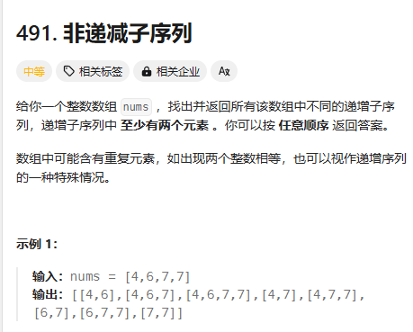
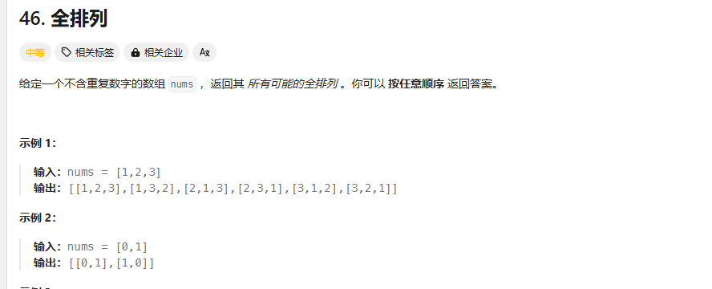
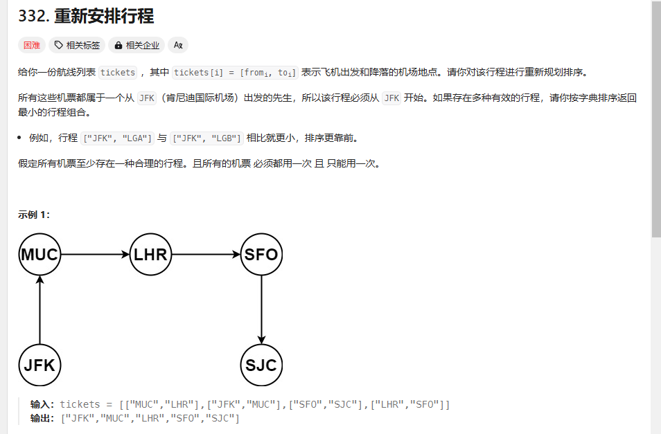
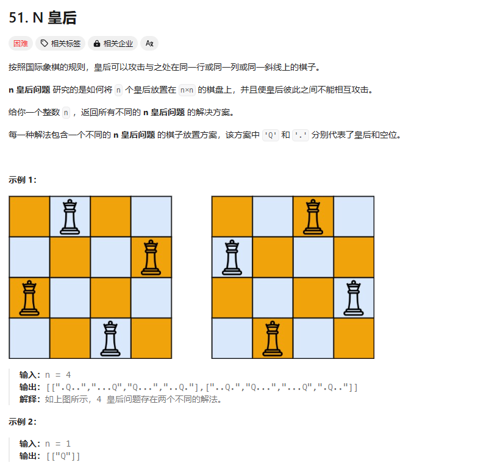
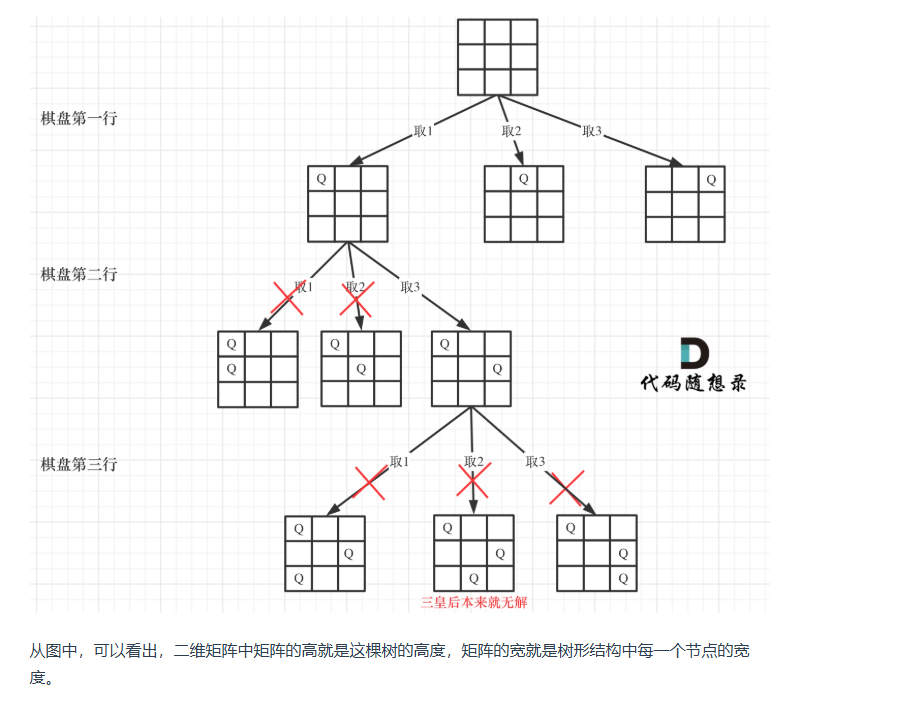
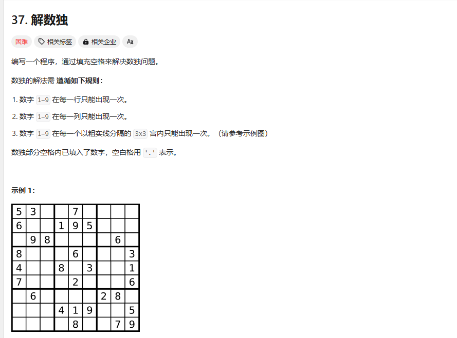

# day 25 回溯算法4 491 46 47 332 51 37

## 491 递增子序列
题目：https://leetcode.cn/problems/non-decreasing-subsequences/description/

感觉是在path.push的时候进行限制
```
class Solution {
public:
    vector<vector<int>>res;
    vector<int>path;
    void backkingt(vector<int>nums,int index,int pre)
    {
        if(path.size()>=2)
        {
            //cout<<"path"<<path[0]<<"num"<<nums[index]<<endl;
            //if(pre>nums[index])
            res.push_back(path);
            //return;//这里不能return
        }

        for(int i=index;i<nums.size();i++)
        {
            //cout<<"i"<<i<<"pre"<<pre<<endl;
            if(i>index&&nums[i]==nums[i-1])continue;
            if(nums[i]>=pre){
                path.push_back(nums[i]);
            backkingt(nums,i+1,nums[i]);
            path.pop_back();
            }
        }
    }
    vector<vector<int>> findSubsequences(vector<int>& nums) {
        res.clear();
        path.clear();
        int pre=INT_MIN;
        backkingt(nums,0,INT_MIN);
        return res;
    }
};
```
在过这个的时候不对了，答案太多东西也看不出来到底哪里不对了
[1,2,3,4,5,6,7,8,9,10,1,1,1,1,1]

题解用了一个used数组

不能排序，排序之后会改变答案

包含去重逻辑，因为数组不能排序所以去重只能用used数组了，对树层进行去重，树枝上不用去重

终止条件：结果在节点上，跟子集类似，每个节点（大小大于等于2）都是结果
```
class Solution {
public:
    vector<vector<int>>res;
    vector<int>path;
    void backkingt(vector<int>nums,int index,int pre)
    {
        if(path.size()>=2)//index>nums.size()自然就会达到,终止条件
        {
            res.push_back(path);
            //return;//这里不能return
        }
        unordered_set<int>useset;//用来去重的
        for(int i=index;i<nums.size();i++)//取数的逻辑
        {
            
             if ((!path.empty() && nums[i] < path.back())
                    || useset.find(nums[i]) != useset.end()) {//剪枝条件，现在的数比前一个小就不要，因此要求path不为空,这个数前面用过了也不要

                    continue;
            }
            path.push_back(nums[i]);
            useset.insert(nums[i]);//是局部变量，不用回溯，只需要记录本层里不要重复取就可以了
            backkingt(nums,i+1,nums[i]);
            path.pop_back();
        }
    }
    vector<vector<int>> findSubsequences(vector<int>& nums) {
        res.clear();
        path.clear();
        int pre=INT_MIN;
        backkingt(nums,0,INT_MIN);
        return res;
    }
};
```
## 46 全排列
题目：https://leetcode.cn/problems/permutations/description/

ohh这不就是把for循环条件改一下吗

哦，不是，没有大小为1的子序列
```
class Solution {
public:
    vector<vector<int>> res;
    vector<int> path;
    void backkingtracr(vector<int>nums,int index)
    {
        if(path.size()==nums.size())//终止条件
        {
            res.push_back(path);return;
        }
        unordered_set<int>usett;
        for(int i=0;i<nums.size();i++)
        {
            if(usett.find(nums[i])!=usett.end())continue;
            path.push_back(nums[i]);
            usett.insert(nums[i]);
            backkingtracr(nums,i+1);
            path.pop_back();
        }
    }
    vector<vector<int>> permute(vector<int>& nums) {
        res.clear();path.clear();
        backkingtracr(nums,0);
        return res;
    }
};
```

为什么这个题就不用set了

难道是它是全局的？
```
class Solution {
public:
    vector<vector<int>> res;
    vector<int> path;
    void backkingtracr(vector<int>nums,vector<bool>used)
    {
        if(path.size()==nums.size())//终止条件
        {
            res.push_back(path);return;
        }
        for(int i=0;i<nums.size();i++)
        {
            if(used[i])continue;
            path.push_back(nums[i]);
            used[i]=true;
            backkingtracr(nums,used);
            used[i]=false;
            path.pop_back();
        }
    }
    vector<vector<int>> permute(vector<int>& nums) {
        res.clear();path.clear();
        vector<bool> used(nums.size(),false);
        backkingtracr(nums,used);
        return res;
    }
};
```

>大家此时可以感受出排列问题的不同：

>每层都是从0开始搜索而不是startIndex
>需要used数组记录path里都放了哪些元素了
>排列问题是回溯算法解决的经典题目，大家可以好好体会体会

组合类问题中使用了index避免重复取出某个数，但是在排列里不用index，所以额外使用used数组标记使用过的元素

对树枝去重，没有重复元素不用树层去重
## 47 全排列Ⅱ
题目：https://leetcode.cn/problems/permutations-ii/description/

有重复元素，树层和树枝都要剪枝，先排序
```
class Solution {
public:
    vector<vector<int>> res;
    vector<int> path;
    void backkingtrace(vector<int> nums,vector<bool>&used)
    {
        if(path.size()==nums.size())
        {
            res.push_back(path);
            return;
        }
        unordered_set<int>usedset;
        for(int i=0;i<nums.size();i++)
        {
            if(used[i]||usedset.find(nums[i])!=usedset.end())continue;
            path.push_back(nums[i]);
            //cout<<"nums[i]"<<nums[i]<<"i"<<i<<used[i]<<endl;
            used[i]=true;
            usedset.insert(nums[i]);
            backkingtrace(nums,used);
            path.pop_back();
            used[i]=false;
        }
    }
    vector<vector<int>> permuteUnique(vector<int>& nums) {
        res.clear();path.clear();
        sort(nums.begin(),nums.end());
        vector<bool>used(nums.size(),false);
        backkingtrace(nums,used);
        return res;
    }
};
```

剪枝可以替换成：
```
if((i>0&&nums[i]==nums[i-1]&&used[i-1]==false))continue;//used[i-1]==false说明是在树层上，回溯过来了,==true说明是树枝上
            if(used[i]==true)continue;//说明在树枝上取过了
```

解决了我的问题
## 332 重新安排行程（先听了讲解）
题目：https://leetcode.cn/problems/reconstruct-itinerary/description/



```

```
## 51 N皇后（先听了讲解）
题目：https://leetcode.cn/problems/n-queens/description/



要分别把皇后放在不同行不同列上，回溯可能是像上面一个全排列一样，检查某个i/j用过没有？输出的时候是i代表前面有几个点，j代表列上前面有几个点

斜线上也不能出现，这个有点难，不知道是什么条件

前面的组合分割子集，排列问题都是一个集合，这里是一个二维数组

用递归方式模拟嵌套for循环层数，n×n递归n层，每层递归控制一个for循环
第一层第一行，第二层递归第二行

剪枝条件：行相同，列相同，45度角相同

3×3的n皇后没有解



用全局变量收集结果，是个三维数组，因为棋盘是二维的，答案里有若干棋盘

```
class Solution {
public:
    vector<vector<string>> res;
    // bool isvalid(vector<string> &chessboard,int row,int column,int n)
    // {
    //     //for(int i=0;i<n;i++){if(chessboard[row][i]=='Q')return false;}//行
    //     for(int i=0;i<row;i++){if(chessboard[i][column]=='Q')return false;}//列
    //     //int wai=row+column;
    //     //for(int i=0;i<n;i++){
    //         //if(wai+i<n)if(chessboard[i][wai+i]=='Q')return false;//135度 是错的
    //         //if(wai-i>0)if(chessboard[i][wai-i]=='Q')return false;//45度 是错的
    //     //}
    //     for(int i=row-1,j=column-1;i>=0&&j>=0;i--,j--)//45度
    //     {
    //         if(chessboard[i][j]=='Q')return false;
    //     }
    //     for(int i=row-1,j=column+1;i>=0&&j<n;i--,j++)//135度
    //     {
    //         if(chessboard[i][j]=='Q')return false;
    //     }
    //     return true;
    // }

    bool isvalid( vector<string>& chessboard,int row, int col, int n) {
    // 检查列
    for (int i = 0; i < row; i++) { // 这是一个剪枝
        if (chessboard[i][col] == 'Q') {
            return false;
        }
    }
    // 检查 45度角是否有皇后
    for (int i = row - 1, j = col - 1; i >=0 && j >= 0; i--, j--) {
        if (chessboard[i][j] == 'Q') {
            return false;
        }
    }
    // 检查 135度角是否有皇后
    for(int i = row - 1, j = col + 1; i >= 0 && j < n; i--, j++) {
        if (chessboard[i][j] == 'Q') {
            return false;
        }
    }
    return true;
}

    void backking(vector<string>&chessboard,int n,int row)//这里要用引用,这里有问题
    {
        if(row==n)
        {
            res.push_back(chessboard);//递归的时候已经对合法性进行判断了
            return ;
        }

        for(int i=0;i<n;i++)
        {
            if(isvalid(chessboard,row,i,n)){chessboard[row][i]='Q';//因为这里if没把大家框起来
            backking(chessboard,n,row+1);
            chessboard[row][i]='.';}
        }
    }

//     void backtracking( vector<string>& chessboard,int n, int row) {
//     if (row == n) {
//         res.push_back(chessboard);
//         return;
//     }
//     for (int i = 0; i < n; i++) {
//         if (isvalid(chessboard,row, i,  n)) { // 验证合法就可以放
//             chessboard[row][i] = 'Q'; // 放置皇后
//             backtracking(chessboard,n, row + 1);
//             chessboard[row][i] = '.'; // 回溯，撤销皇后
//         }
//     }
// }

    vector<vector<string>> solveNQueens(int n) {
        res.clear();
        std::vector<std::string>chessboard(n,std::string(n,'.'));//因为n是传进来的，不能单纯定义全局变量
        backking(chessboard,n,0);
        return res;
    }
};
```

知道了怎么做的也很难写出来，小细节错误太多了

## 37 解数独（先听了讲解）
题目：https://leetcode.cn/problems/sudoku-solver/description/

感觉跟n皇后一个思路，重点还是在判断是否是合法的。比n皇后多一个维度，因为不是只放一个元素，要放1-9

两层递归，两个for循环+一个递归函数
for循环一个遍历行一个遍历列，递归用来遍历数字

区别：只求一个数组，棋盘填满了立刻返回，递归函数是bool类型的，找到结果立刻返回

终止条件：填满棋盘之后直接return其实不需要终止条件
```

```