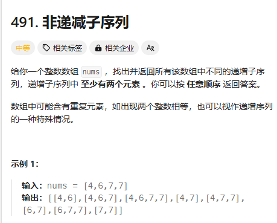

# day 25 回溯算法4 491 46 47 332 51 37

## 491 递增子序列
题目：https://leetcode.cn/problems/non-decreasing-subsequences/description/

感觉是在path.push的时候进行限制
```
class Solution {
public:
    vector<vector<int>>res;
    vector<int>path;
    void backkingt(vector<int>nums,int index,int pre)
    {
        if(path.size()>=2)
        {
            //cout<<"path"<<path[0]<<"num"<<nums[index]<<endl;
            //if(pre>nums[index])
            res.push_back(path);
            //return;//这里不能return
        }

        for(int i=index;i<nums.size();i++)
        {
            //cout<<"i"<<i<<"pre"<<pre<<endl;
            if(i>index&&nums[i]==nums[i-1])continue;
            if(nums[i]>=pre){
                path.push_back(nums[i]);
            backkingt(nums,i+1,nums[i]);
            path.pop_back();
            }
        }
    }
    vector<vector<int>> findSubsequences(vector<int>& nums) {
        res.clear();
        path.clear();
        int pre=INT_MIN;
        backkingt(nums,0,INT_MIN);
        return res;
    }
};
```
在过这个的时候不对了，答案太多东西也看不出来到底哪里不对了
[1,2,3,4,5,6,7,8,9,10,1,1,1,1,1]

题解用了一个used数组，明天再揣摩一下
## 46 全排列
题目：https://leetcode.cn/problems/permutations/description/
```

```
## 47 全排列Ⅱ
题目：https://leetcode.cn/problems/permutations-ii/description/
```

```

## 332 重新安排行程
题目：https://leetcode.cn/problems/reconstruct-itinerary/description/
```

```
## 51 N皇后
题目：https://leetcode.cn/problems/n-queens/description/
```

```

## 37 解数独
题目：https://leetcode.cn/problems/sudoku-solver/description/
```

```