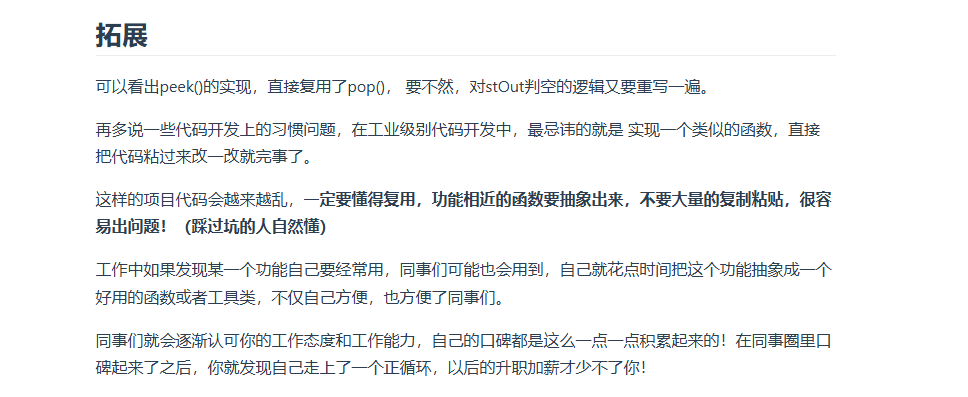

# day10 栈与队列1 理论基础 232 225 20 1047

## 理论基础
https://blog.csdn.net/zll19950614/article/details/107645579

栈是top，队列是front和back

https://blog.csdn.net/tham_/article/details/44733101

栈要注意检查top和pop的时候栈是不是空

## 232 用栈实现队列
题目：https://leetcode.cn/problems/implement-queue-using-stacks/description/

应该是用一个栈输入，输出的时候先把输入栈里面的数据放到输出栈里面然后再输出
```
class MyQueue {
public:
    stack<int> stIn;
    stack<int> stOut;
    MyQueue() {
        
    }
    
    void push(int x) {
        stIn.push(x);
    }
    
    int pop() {
        if(stOut.empty())
        {
            int x;
            while(!stIn.empty())
            {
                stOut.push(stIn.top());
                stIn.pop();
            }
        }
        int ret=stOut.top();
        stOut.pop();
        return ret;
    }
    
    int peek() {
         if(stOut.empty())
        {
            int x;
            while(!stIn.empty())
            {
                stOut.push(stIn.top());
                stIn.pop();
            }
        }
        int ret=stOut.top();
        return ret;
    }
    
    bool empty() {
        return (stIn.empty()&&stOut.empty());
    }
};

/**
 * Your MyQueue object will be instantiated and called as such:
 * MyQueue* obj = new MyQueue();
 * obj->push(x);
 * int param_2 = obj->pop();
 * int param_3 = obj->peek();
 * bool param_4 = obj->empty();
 */
```
好吧：

## 225 用队列实现栈
题目：https://leetcode.cn/problems/implement-stack-using-queues/description/

一个队列在模拟栈弹出元素的时候只要将队列头部的元素（除了最后一个元素外） 重新添加到队列尾部，此时再去弹出元素就是栈的顺序了。把队列尾巴作为栈头

记得要除了最后一个元素，因为要取它

```
class MyStack {
public:
    queue<int>q;
    MyStack() {
        
    }
    
    void push(int x) {
        q.push(x);
    }
    
    int pop() {
        int size=q.size();
        size--;
        while(size--)
        {
            q.push(q.front());
            q.pop();
        }
        int res=q.front();
        q.pop();
        return res;
    }
    
    int top() {
        int ret=this->pop();
        q.push(ret);
        return ret;
    }
    
    bool empty() {
        return q.empty();
    }
};

/**
 * Your MyStack object will be instantiated and called as such:
 * MyStack* obj = new MyStack();
 * obj->push(x);
 * int param_2 = obj->pop();
 * int param_3 = obj->top();
 * bool param_4 = obj->empty();
 */
```
## 20 有效的括号
题目：https://leetcode.cn/problems/valid-parentheses/description/
给定一个只包括 '('，')'，'{'，'}'，'['，']' 的字符串 s ，判断字符串是否有效。
示例 4：

输入：s = "([])"

输出：true

这个我有印象！左括号压栈，右括号检查匹配，最后看是不是栈为空

本来是这样：报错了

```
class Solution {
public:
bool isValid(string s) {
stack<char>accept;
for(int i=0;i<s.size();i++)
{
if(s[i]=='('||s[i]=='{'||s[i]=='[')accept.push(s[i]);
if(s[i]==')')
if(accept.top()=='(')accept.pop();
else if(s[i]=='}')
if(accept.top()=='{')accept.pop();
else
if(accept.top()=='[')accept.pop();
}
if(accept.empty())return true;
else return false;
}
};
```
询问了poe之后存在pop的时候栈为空没有处理的问题，还有if的结构混乱，改成：之后过了
```
class Solution {
public:
    bool isValid(string s) {
        stack<char>accept;
        for(int i=0;i<s.size();i++)
        {
            if(s[i]=='('||s[i]=='{'||s[i]=='[')accept.push(s[i]);
            else{
            if(accept.empty())return false;
            if(s[i]==')')
                if(accept.top()=='(')accept.pop();else return false;
            else if(s[i]=='}')
                if(accept.top()=='{')accept.pop();else return false;
            else 
                if(accept.top()=='[')accept.pop();else return false;

            }

        }
        return accept.empty();
    }
};
```

## 1047 删除字符串中所有相邻重复项
题目：https://leetcode.cn/problems/remove-all-adjacent-duplicates-in-string/description/

给出由小写字母组成的字符串 s，重复项删除操作会选择两个相邻且相同的字母，并删除它们。

在 s 上反复执行重复项删除操作，直到无法继续删除。

在完成所有重复项删除操作后返回最终的字符串。答案保证唯一。
 

示例：

输入："abbaca"

输出："ca"

解释：
例如，在 "abbaca" 中，我们可以删除 "bb" 由于两字母相邻且相同，这是此时唯一可以执行删除操作的重复项。之后我们得到字符串 "aaca"，其中又只有 "aa" 可以执行重复项删除操作，所以最后的字符串为 "ca"。

好申金的题...就是用栈看前面的是不是一样的，一样的就不入栈了，删掉栈顶元素，最后输出栈里面的元素，要保证顺序一样应该是用队列。。

结果还是用的栈，我自己根本做不到bugfree（:(）

代码随想录也是栈

```
class Solution {
public:
    string removeDuplicates(string s) {
        stack<char>dele;
        for(int i=0;i<s.size();i++)
        {
            if(dele.empty()||s[i]!=dele.top())dele.push(s[i]);//为空的话元素直接塞进去
            else//相等的话弹出栈删除
                dele.pop();
        }
        string res;
        while(!dele.empty())
        {
            res+=dele.top();
            dele.pop();
        }
        reverse(res.begin(),res.end());
        return res;
    }
};
```
