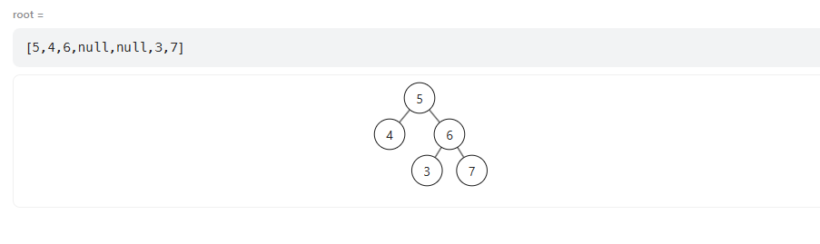

# day17 二叉树5 654 617 700 98

## 654 最大的二叉树
题目：https://leetcode.cn/problems/maximum-binary-tree/description/

构造二叉树类的题目一般都要用前序遍历，因为要先构造根节点

```
class Solution {
private:
    TreeNode* trav(vector<int>& nums,int begin,int end) {
        //if(nums.size()==0)return nullptr;//终止条件，中左右遍历
        if(begin>end)return nullptr;
        int indd=begin;
        for(int i=begin+1;i<=end;i++)//对中的处理，找到当前序列中的最大值生成一个treenode
            {if(nums[i]>nums[indd])
                {indd=i;}}

        TreeNode* root=new TreeNode(nums[indd]);
        
        root->left=trav(nums,begin,indd-1);
        root->right=trav(nums,indd+1,end);

        return root;
    }
public:
    TreeNode* constructMaximumBinaryTree(vector<int>& nums) {
        if(nums.size()==0)return nullptr;
        return trav(nums,0,nums.size()-1);
    }
};
```

## 617 合并二叉树
题目：https://leetcode.cn/problems/merge-two-binary-trees/description/


```
TreeNode* mergeTrees(TreeNode* root1, TreeNode* root2) {
        if(root2==nullptr)return root1;
        if(root1==nullptr)return root2;
        TreeNode* node =new TreeNode(0);

        node->val=root1->val+root2->val;
        

        node->left=mergeTrees(root1->left,root2->left);
        node->right=mergeTrees(root1->right,root2->right);

        return node;
    }
```

## 700 二叉搜索树中的搜索
题目：https://leetcode.cn/problems/search-in-a-binary-search-tree/description/


```
TreeNode* searchBST(TreeNode* root, int val) {
        if(root==nullptr)return root;
        if(root->val==val)return root;
        TreeNode * node;
        if(root->val<val)node=searchBST(root->right,val);
        if(root->val>val)node=searchBST(root->left,val);
        return node;
    }
```

## 98 验证二叉搜索树
题目：https://leetcode.cn/problems/validate-binary-search-tree/description/


一个错误方法：主要是不能单纯比较左右子树是否满足左中右，而是要满足中序序列是一个有序序列

反例是这个：

```
bool isValidBST(TreeNode* root) {
        bool l,r;
        if(root==nullptr)return true;//空树成立
        if(root->left==nullptr&&root->right==nullptr)return true;
        if(root->left)l=isValidBST(root->left);
        if(root->left)if(root->left->val>=root->val)return false;
        if(root->right)if(root->right->val<=root->val)return false;
        if(root->right)r=isValidBST(root->right);
        return l&&r;
    }
```

```
class Solution {
public:
    long long maxval=LONG_MIN;
    bool isValidBST(TreeNode* root) {
        bool l,r;
        if(root==nullptr)return true;//空树成立
        //if(root->left==nullptr&&root->right==nullptr)return true;

        l=isValidBST(root->left);

        if(maxval<root->val)maxval=root->val;//中
        else return false; 


        r=isValidBST(root->right);
        return l&&r;
    }
};
```