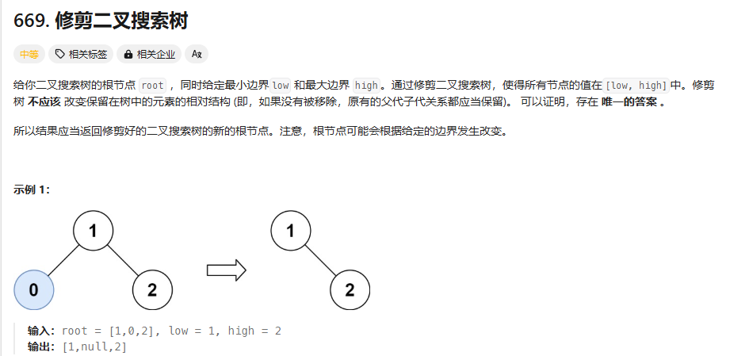

# day21 二叉树8 669 108 538 总结

## 669 修剪二叉搜索树
题目：https://leetcode.cn/problems/trim-a-binary-search-tree/description/




感觉是二叉树删除的增强版，可以套那个题吧，检查到在范围之外的节点就删除

题解：
终止条件：
1. 对于小于区间左边界的节点。右孩子可能符合要求，继续向右遍历(不直接返回右孩子是因为右孩子里面可能会有不符合要求的节点，需要递归处理右子树)
2. 数值大于右区间，该节点左孩子可能符合要求，继续向左遍历

然后正常递归左子树右子树

最后返回root
```
class Solution {
public:
    
    TreeNode* trimBST(TreeNode* root, int low, int high) {
        if(root==nullptr)return root;
        if(root->val<low)return trimBST(root->right,low,high);
        if(root->val>high)return trimBST(root->left,low,high);

        root->left=trimBST(root->left,low,high);
        root->right=trimBST(root->right,low,high);

        return root;
    }
};
```

## 108 将有序数组转化为二叉搜索树
题目：https://leetcode.cn/problems/convert-sorted-array-to-binary-search-tree/description/

转化为avl

不要掉进怎么保证二叉树是avl的陷阱

```
class Solution {
public:
    TreeNode* convvert(vector<int>& nums,int low,int high) {
        if(low>high)return nullptr;
        int mid=low+(high-low)/2;
        TreeNode *root=new TreeNode(nums[mid]);

        root->left=convvert(nums,low,mid-1);
        root->right=convvert(nums,mid+1,high);

        return root;
    }
    TreeNode* sortedArrayToBST(vector<int>& nums) {
        if(nums.size()==0)return nullptr;
        TreeNode *root=convvert(nums,0,nums.size()-1);
        return root;
    }
};
```
## 把二叉搜索树转化为累加树
题目：https://leetcode.cn/problems/convert-bst-to-greater-tree/description/

没看懂题目

```
class Solution {
public:
    int sum=0;
    TreeNode* convertBST(TreeNode* root) {
        if(root==nullptr)return nullptr;
        root->right=convertBST(root->right);
        sum+=root->val;
        root->val=sum;
        root->left=convertBST(root->left);
        return root;
    }
};
```

搞懂之后就过了，右中左依次进行一个值填充