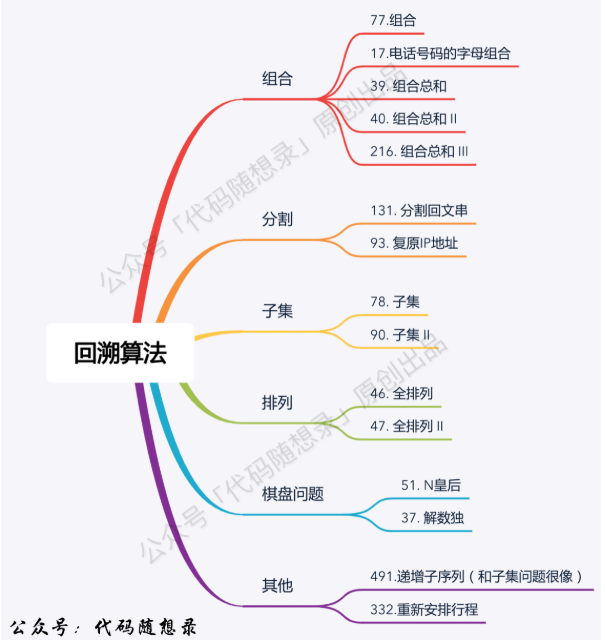
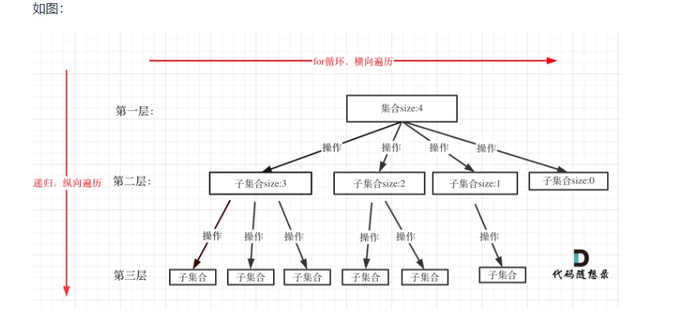

# day22 回溯算法 理论基础 77 216 17

## 理论基础

回溯法也可以叫做回溯搜索法，它是一种搜索的方式。

在二叉树系列中，我们已经不止一次，提到了回溯，例如二叉树：以为使用了递归，其实还隐藏着回溯 (opens new window)。

回溯是递归的副产品，只要有递归就会有回溯。

所以以下讲解中，回溯函数也就是递归函数，指的都是一个函数

使用原因：只有这种暴力方法可以搜索到所有结果，比如说组合问题（四个数里有几个两个数的组合），切割问题


**回溯法都可以抽象为一个树形结构，树的宽度是集合的大小，用for循环遍历，深度是递归的深度，回溯的终止条件等于树的深度，每一层递归是用for循环处理我们需要的元素**

相当于递归里面嵌套for循环



回溯法框架模板：
```
void backtracking(参数) {
    if (终止条件) {//一般是收集结果的时候，一般在叶子节点收集
        存放结果;
        return;
    }

    for (选择：本层集合中元素（树中节点孩子的数量就是集合的大小）) {//单层搜索逻辑，用来处理每一个元素
        处理节点;
        backtracking(路径，选择列表); // 递归
        回溯，撤销处理结果
    }
}
```

## 77 组合
题目：https://leetcode.cn/problems/combinations/description/

start=1的时候嵌套 了234的for循环，在里面输出了[1,2][1,3][1,4]之后跳了backtracr(n,k,2),把1pop掉
```
class Solution {
public:
    vector<vector<int>> res;
    vector<int>num;
    void backtrace(int n,int k,int start)
    {
        if(num.size()==k)//终止条件，正确
        {
            res.push_back(num);return;
        }
        for(int i=start;i<=n;i++)//单层逻辑
        {
            num.push_back(i);
            backtrace(n,k,i+1);
            num.pop_back();
        }

    }
    vector<vector<int>> combine(int n, int k) {
        res.clear();
        num.clear();
        backtrace(n,k,1);
        return res;
    }
};
```

还可以进行剪枝优化，把逻辑上不可能有结果的东西剪掉，优化单层逻辑

在for范围里面选出最远要选到哪里比如说n=4，k=4，我们要选的是k-path.size()得到还需要选取的元素个数，至多要从n-(k-path.size())+1, 选择，后面的情况肯定不行，用这个表达式替换size


## 216 组合总和Ⅲ
题目：https://leetcode.cn/problems/combination-sum-iii/description/

返回i+k+j=n的不同组合

当前值等于n的时候返回，如果大于的话就没有必要再遍历了？

感觉明明思路是对的为什么不行呢

```
class Solution {
public:
    vector<vector<int>>res;
    vector<int>num;
    void backk(int k,int n,int start,int sheng)
    {
        if(num.size()==k)//终止条件，大于n的时候返回空，=n且size=3的时候加入结果集
        {
            if(sheng==0){res.push_back(num);}//不能且在一起，因为值不满足条件也要返回
            return ;
        }
        if(start>=sheng)return ;

        for(int i=start;i<=9;i++)
        {
            //if(i>sheng)break;
            num.push_back(i);
            backk(n,k,i+1,sheng-i);//因为我把这里写反了
            num.pop_back();
        }
    }
    vector<vector<int>> combinationSum3(int k, int n) {
        res.clear();
        num.clear();
        backk(k,n,1,n);
        return res;
    }
};
```

哈哈，血压因为一个简单错误起来了，改掉就对了

不过说明我已经有回溯的思路了

k控制树深度，1-9控制宽度
k=3的时候深度就是2

k=5的时候789也没有意义了，for循环里面可以进行修改。

for(int i=start;i<=9;i++)<=9可以改成<=n-(k-num.size())+1

+1是把下标补齐
## 17 电话号码的字母组合
题目：https://leetcode.cn/problems/letter-combinations-of-a-phone-number/description/

字符串操作不熟悉不知道string能有什么操作，没啥思路，要用很多switch吗

可以用二维数组做映射

深度是输入的数字的多少，宽度是一个数字对应几个字母

叶子节点收获结果


```
class Solution {
private:
const string letterMap[10]=
{
    "",//0
    "",//1
   "abc", // 2
    "def", // 3
    "ghi", // 4        
    "jkl", // 5
    "mno", // 6
    "pqrs", // 7
    "tuv", // 8
    "wxyz", // 9
};
public:
    vector<string> res;
    string s;
    void backk(string digits,int index)//index表示递归中字符串遍历到哪一个数字了
    {
        if(index==digits.size())//终止条件
        {
            res.push_back(s);
            return;
        }
        int digit=digits[index]-'0';//获取当前要处理的字母

        string letter =letterMap[digit];

        for(int i=0;i<letter.size();i++)
        {
            s.push_back(letter[i]);
            backk(digits,index+1);
            s.pop_back();
        }


    }
    vector<string> letterCombinations(string digits) {
        res.clear();
        s.clear();
        if(digits.size()==0)return res;
        backk(digits,0);
        return res;
    }
};
```

主要就是映射不会写，其它操作和普通数组一样