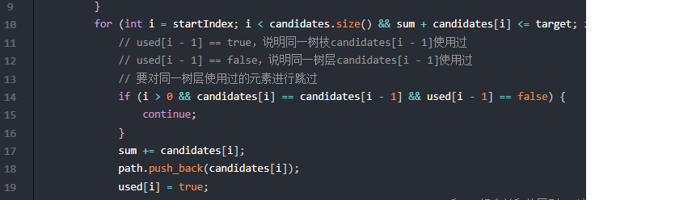
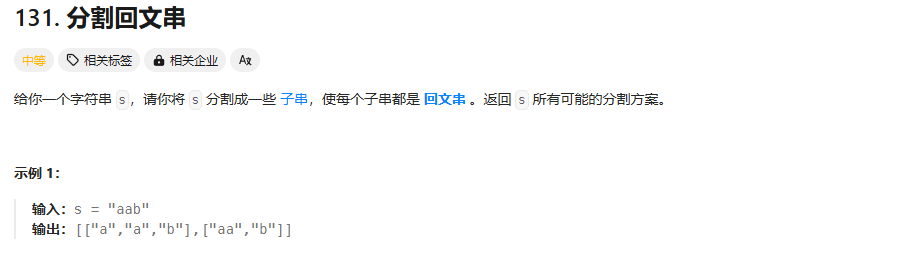
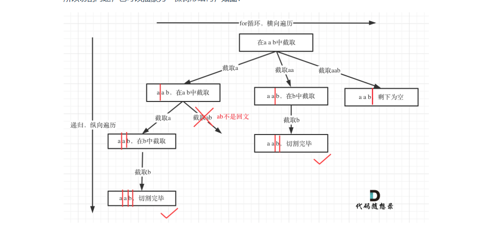

# day23 回溯算法2 39 49 131
## 39 组合总和
题目：https://leetcode.cn/problems/combination-sum/description/

不是1-n，不限制k而且数据可以重复使用的组合总和

感觉只能用sum作为终止条件了

```
class Solution {
public:
    vector<vector<int>> res;
    vector<int>path;
    void backkt(vector<int>& candidates, int target,int sum,int index)
    {
        if(sum==target)//终止条件
        {
            res.push_back(path);return ;
        }

        if(sum>target)return;

        for(int i=index;i<candidates.size();i++)
        {
            if(candidates[i]>target)break;//数组不是按照顺序出现的不能加这句，会少结果
            path.push_back(candidates[i]);
            backkt(candidates,target,sum+candidates[i],index);//这里index改成i
            path.pop_back();
        }
    }
    vector<vector<int>> combinationSum(vector<int>& candidates, int target) {
        res.clear();
        path.clear();
        backkt(candidates,target,0,0);
        return res;
    }
};
```
这个老是输出重复的组合，把递归里面的index改成i就过了

有重复选取的情况要考虑0，0一直加会死循环，这里题目说了没有0，有重复数组要去重（下一个题就是）

剪枝：当前和加上当前值大于target之后，后面就没有必要再搜索了

## 49 组合总和Ⅱ
题目：https://leetcode.cn/problems/combination-sum-ii/description/

每个数字只能使用一次

```
class Solution {
public:
    vector<vector<int>> res;
    vector<int> path;
    void backtt(vector<int>& candidates, int target,int index,int sum )
    {
        if(sum==target)
        {
            res.push_back(path);
            return;
        }

        //if(sum>target)return;

        for(int i=index;i<candidates.size()&&(sum+candidates[i])<=target;i++)//这个是树层
        {
            //if(candidates[i]>target)continue;
            if(i>index&&candidates[i]==candidates[i-1])continue;//树层上的去重
            path.push_back(candidates[i]);
            backtt(candidates,target,i+1,sum+candidates[i]);
            path.pop_back();
        }
    }
    vector<vector<int>> combinationSum2(vector<int>& candidates, int target) {
        res.clear();
        path.clear();
        sort(candidates.begin(),candidates.end());
        backtt(candidates,target,0,0);
        return res;
    }
};
```
结果集去重好难啊，我只想到了排序
对数组进行排序是sort(数组.begin(),数组.end());

后面是看了题解说一是可以用used数组判断一个数字是不是使用过了，使用过就不用再用了，觉得麻烦，还有一个方法是用index标记，如果i>index而且和前一个数值相同就跳过这个回合，这样可以避免同样的元素，在操作过程中去重

还有一个就是for循环的条件和中途return的条件要注意细节

树层去重：两个重复元素一起的时候，前面的元素会包含后面的所有可能解，需要去重

树枝去重：[1,1,6]这种可以持续选两个不一样的1，可以不去重



这里used=false是树层的情况，=true是树枝的情况，是应该保留的

## 131 分割回文串
题目：https://leetcode.cn/problems/palindrome-partitioning/description/


s仅有小写字母

是不是可以用一个函数判断是不是回文串，双指针头尾判断，有不相同返回false

然后回溯就是增加长度，初始是一个字母，然后是开始是两个字母，滑动窗口向后，然后是三个4个？

尝试一番

看一下题解似乎是一开始进行分割，比如说abcd，把a分割了之后在bcd里面进行分割



所以例子里面第一个是切割第一个a第二个是切割第二个a，神秘

```
class Solution {
public:
    vector<vector<string>> res;
    vector<string>path;
    string strr;
    bool ishuiwen(string s,int start,int end)
    {
        for(int i=start,j=end;i<j;i++,j--)
        {
            if(s[i]!=s[j])return false;
        }
        return true;
    }


    void backking(const string &s,int index)//index作为切割线
    {
        // if(index==s.size())
        // {
        //     if(ishuiwen(s)){path.push_back(s);index=s.size();}
        // }

        if(index>=s.size())//终止条件
        {
            res.push_back(path);
            return ;
        }
        // int k=0;
        // while(length==1&&k<s.size())//长度为1的时候所有都是回文子串
        //     {
        //         strr=s[k++];
        //         path.push_back(strr);
        //     }
        for(int i=index;i<s.size();i++)
        {
            //strr=s(s.begin()+index,s.begin()+index+length);
            if(ishuiwen(s,index,i))path.push_back(s.substr(index,i-index+1));//子串是index到i
            else continue;
            backking(s,i+1);

            path.pop_back();
        }
    }
    vector<vector<string>> partition(string s) {
        res.clear();
        path.clear();
        backking(s,0);
        return res;
    }
};
```

主要是没有想到这样切割，我一开始以为是长度为1单独处理，然后是长度为2，，，长度为n，所以想不到怎么回溯（但是还是把模板写出来了），还有一个是不知道怎么取子串

切割问题其实跟之前组合问题思路是一样的

注意细节：
1. 什么是切割线：index
2. 切割范围：index-i

void函数最后没有return也可以
