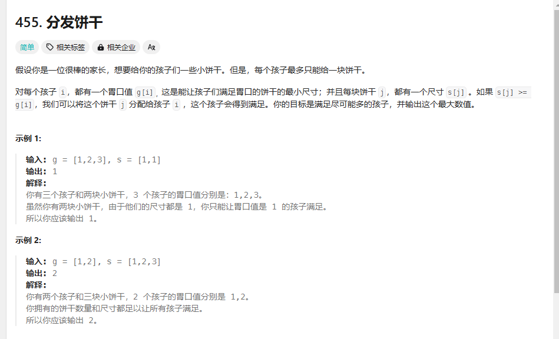

# day27 贪心算法1 理论基础 455 376 53

## 理论基础

什么是贪心算法：找到局部最优推到全局最优

积极使用俺寻思之力

贪心算法两个极端：要么很简单要么要么特别难

思路：可以找到局部最优且想不出来反例，可以试一下贪心的策略

>贪心算法一般分为如下四步：

>1. 将问题分解为若干个子问题
>2. 找出适合的贪心策略
>3. 求解每一个子问题的最优解
>4. 将局部最优解堆叠成全局最优解
>
>这个四步其实过于理论化了，我们平时在做贪心类的题目时，如果按照这四步去思考，真是有点“鸡肋”。

>做题的时候，只要想清楚 局部最优 是什么，如果推导出全局最优，其实就够了。


## 455 分发饼干

题目：https://leetcode.cn/problems/assign-cookies/description/

```
class Solution {
public:
    int findContentChildren(vector<int>& g, vector<int>& s) {
        sort(g.begin(),g.end());
        sort(s.begin(),s.end());
        int sum=0;
        int child=0;
        for(int i=0;i<s.size();i++)
        {
            if(child<g.size()&&s[i]>=g[child])//当前饼干分给一个小孩
            {
                sum++;
                child++;
            }
        }
        return sum;
    }
};
```

小孩好
## 376 摆动序列
题目：https://leetcode.cn/problems/wiggle-subsequence/description/

错误：数学坏
```
class Solution {
public:
    int wiggleMaxLength(vector<int>& nums) {
        int num=0;
        vector<int>res(nums.size(),0);//子序列
        bool zero=false;
        for(int i=0;i<nums.size()-1;i++)
        {
            if(nums[i]!=0)zero=true;
            
        }
        if(nums.size()==1)return 1;
        if(nums.size()==2&&nums[0]!=nums[1])return 2;
        if(nums.size()==2&&nums[0]==nums[1])return 1;
        for(int i=0;i<nums.size()-1;i++)
        {
            res[i]=nums[i+1]-nums[i];
            
        }

        for(int i=0;i<res.size()-1;i++)
        {
            if((res[i+1]>0&&res[i]<0)||(res[i+1]<0&&res[i]>0))num++;
        }
        if(zero)
        return num+2;
        else return 1;
    }
};
```
有两个相同的数就不算摆动了，长度为2两端数值不同，有两个摆动

把数字分布在坐标轴里，顶点和底点的个数是摆动，把单调坡上面的元素删掉

局部最优是删除单调坡上的元素，全局最优是最长的摆动序列

遇到摆动记录值，遇到坡度就不++

摆动条件：前面两个差值和后面两个差值一正一负

情况1：上下坡有平坡（17，5，6，7，17，1）567就是坡

情况2：首尾元素：只有两个元素prediff（前面两个数的差）为0

情况3 单调有坡（1，2，2，2，3，4），只有一头一尾两个摆动，但是走上面的逻辑的时候在2，2，3的时候会+1，问题出在prediff=currentdif,但是prediff只需要在坡度变化的时候记录坡度原始的方向，让prediff跟最终结果一起改变就行
```
class Solution {
public:
    int wiggleMaxLength(vector<int>& nums) {
        int num=1;//默认最右端有坡度
        if(nums.size()==1)return 1;
        int prediff=0;//默认前面会延长一段
        int currentdiff=0;
        if(nums.size()==2&&nums[0]!=nums[1])return 2;
        for(int i=0;i<nums.size()-1;i++)
        {
            currentdiff=nums[i+1]-nums[i];
            if((prediff>=0&&currentdiff<0)||(prediff<=0&&currentdiff>0)){num++;
            prediff=currentdiff;}
        }
        return num;
    }
};
```
## 53 最大子序和
题目：https://leetcode.cn/problems/maximum-subarray/description/
```
class Solution {
public:
    int maxSubArray(vector<int>& nums) {
        int maxnum=INT_MIN;
        int sum=0;
        for(int i=0;i<nums.size();i++)
        {
            if(nums[i]>sum&&sum<0)sum=nums[i];//如果前面的和小于0现在这个是大于0的值肯定加上不会是最大的

            else sum+=nums[i];

            if(sum>maxnum)maxnum=sum;

            //if(nums[i]>0&&sum<0)sum=nums[i];//如果前面的和小于0现在这个是大于0的值肯定加上不会是最大的
            
            //cout<<"sum:"<<sum<<"maxsum"<<maxnum<<endl;
        }
        return maxnum;
    }
};
```
换sum的条件试了好多次，还是没有想清楚

思路：

和是负数+后面的数只会让和变小，不如放弃当前的负和

局部最优：当前和为负数李娇儿抛弃，选择下一个数作为新和

全局最优

只要当前和不是负数都可能让后面的数变大

题解：
```
class Solution {
public:
    int maxSubArray(vector<int>& nums) {
        int result = INT32_MIN;
        int count = 0;
        for (int i = 0; i < nums.size(); i++) {
            count += nums[i];
            if (count > result) { // 取区间累计的最大值（相当于不断确定最大子序终止位置）
                result = count;
            }
            if (count <= 0) count = 0; // 相当于重置最大子序起始位置，因为遇到负数一定是拉低总和
        }
        return result;
    }
};
```
思路正确！