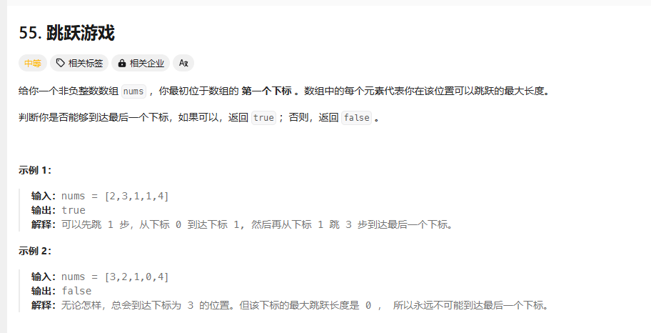
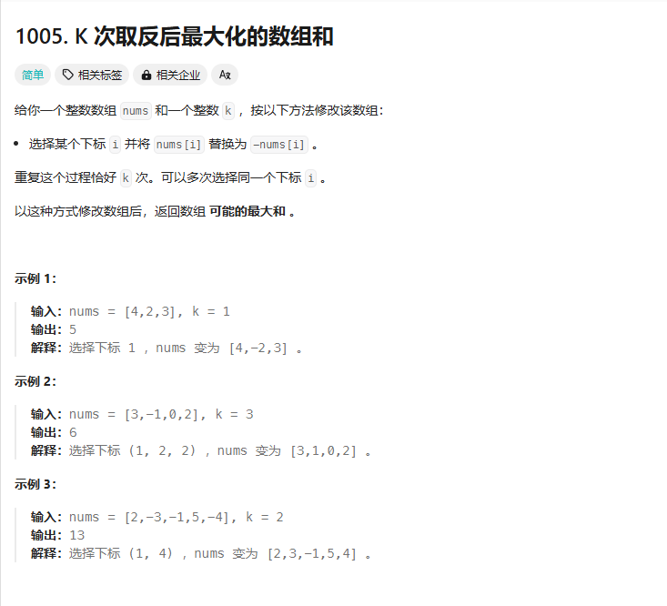

# day28 贪心算法2 122 55 45 1005

## 122 买卖股票的最佳时机Ⅱ
题目：https://leetcode.cn/problems/best-time-to-buy-and-sell-stock-ii/description/

当前数据和后一个比，设置一个flag表示现在是否持有

没持有且当前小于后一天的时候买入

持有且当前小于后一天的时候保持
持有且当前大于后一天的时候卖出

持有且最后一天的时候卖出

```
class Solution {
public:
    int maxProfit(vector<int>& prices) {
        bool flag=false;//初始是没有持有的状态
        int profit=0;//利润初始是0
        int chengben;//成本
        for(int i=0;i<prices.size()-1;i++)
        {
            int pr=prices[i+1]-prices[i];
            if(!flag&&pr>0)
            {
                flag=true;
                chengben=prices[i];
            }
            if(flag&&pr<=0)
            {
                flag=false;
                profit+=prices[i]-chengben;
            }
        }
        if(flag)
            profit+=prices[prices.size()-1]-chengben;
        return profit;
    }
};
```
成功，炒股高手

题解：每天利润=今天-前一天

局部最优：每天利润都是正的，跟上个题思路一致了
```
class Solution {
public:
    int maxProfit(vector<int>& prices) {
        int result = 0;
        for (int i = 1; i < prices.size(); i++) {
            result += max(prices[i] - prices[i - 1], 0);
        }
        return result;
    }
};
```
## 55 跳跃游戏
题目：https://leetcode.cn/problems/jump-game/description/

遇到0且不是在最后一个位置就失败（不对，不是这样的）
其实就是看能碰到的数组的值能不能大于数组长度
是不是要用回溯啊？

跳到的位置总是到0就失败

感觉是回溯啊

错误：

```
class Solution {
public:
    bool jumpp(vector<int>nums,int jump,int index)
    {
        if(jump==0&&index!=nums.size())
        {
            return false;
        }
        if(index+jump>=nums.size()-1)return true;

        for(int i=index;i<index+jump;i++)
        {
            return jumpp(nums,nums[i+1],i+1);
        }
        return false;
    }
    bool canJump(vector<int>& nums) {
        if(nums.size()==0||nums.size()==1)return true;
        int jump=nums[0];
        return jumpp(nums,jump,0);
    }
};
```
老是有一些样例过不了

题解说这两个跳跃问题都很难，谢谢

题解：说是上面那个思路很难想出来了qwq

只看覆盖范围，看能不能最终覆盖重点[2,3,1,1,4]2往后覆盖两个，3，往后覆盖3个
```
class Solution {
public:
    bool canJump(vector<int>& nums) {
        int maxindex=0;
        if(nums.size()==1)return true;
        for(int i=0;i<=maxindex;i++)//只能在覆盖范围移动
        {
            maxindex=max(i+nums[i],maxindex);
            if(maxindex>=nums.size()-1)return true;//要在循环里，范围不能改
        }
        //if(maxindex>=nums.size())return true;
        return false;
    }
};
```
局部最优：尽可能增加覆盖范围
## 45 跳跃游戏Ⅱ
题目：https://leetcode.cn/problems/jump-game-ii/description/

一定能到达，问最小次数，感觉也是回溯

找覆盖范围内index+值最大的？

每次取覆盖范围的最大值
```
class Solution {
public:
    int jump(vector<int>& nums) {
        if(nums.size()==1)return 0;
        int cover=0;
        int next=0;//记录下一步的覆盖范围
        int res=0;
        for(int i=0;i<nums.size();i++)
        {
            next=max(i+nums[i],next);
            if(i==cover)
            {
                if(cover!=nums.size()-1)
                {
                    res++;
                    cover=next;
                    if (cover >= nums.size() - 1) break; 
                }
            }
        }
        return res;
    }
};
```
## 1005 k次取反之后的最大化数组和
题目：https://leetcode.cn/problems/maximize-sum-of-array-after-k-negations/description/



好深津的题

先把负数变正，k还有剩的话就变最小的，然后整体加起来，有0的话多的k给它

```
class Solution {
public:
    int largestSumAfterKNegations(vector<int>& nums, int k) {
        int zero=-1;//记录0的下标，还有剩的k就给它
        int kate=k;
        for(int i=0;i<nums.size();i++)
        {
            if(nums[i]<0&&kate>0){nums[i]=-nums[i];kate--;}//先用负数消耗k
            if(nums[i]==0)zero=i;
        }
        if(kate>0&&zero>-1)kate=0;//剩下的k被0解决了

        int min=INT_MAX;int mini=-1;//找到一个最小的数然后一直给它取负数
        for(int i=0;i<nums.size();i++)
            {
                if(nums[i]<min)
                {
                    mini=i;min=nums[i];
                }
            }

        if(kate%2!=0)nums[mini]=-nums[mini];

        int sum=0;
        for(int i=0;i<nums.size();i++)sum+=nums[i];

        return sum;
        

    }
};
```
错误的，这样不能取出最小负数，哦，可以先排序，先排序之后就没问题了