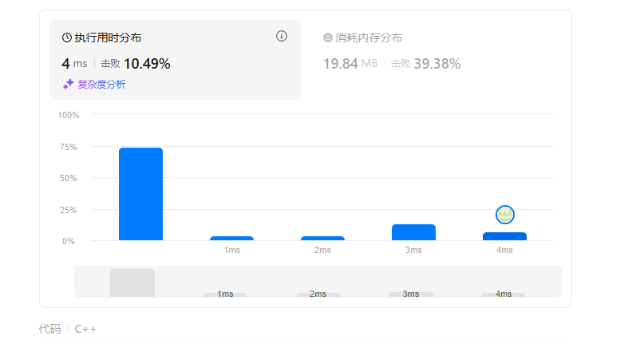

# 链表理论基础 203，707，206

## 链表理论基础
注意：
这里我给出C/C++的定义链表节点方式，如下所示：
```
// 单链表
struct ListNode {
    int val;  // 节点上存储的元素
    ListNode *next;  // 指向下一个节点的指针
    ListNode(int x) : val(x), next(NULL) {}  // 节点的构造函数
};
```
有同学说了，我不定义构造函数行不行，答案是可以的，C++默认生成一个构造函数。

但是这个构造函数不会初始化任何成员变量，下面我来举两个例子：

通过自己定义构造函数初始化节点：
```
ListNode* head = new ListNode(5);
```
使用默认构造函数初始化节点：
```
ListNode* head = new ListNode();
head->val = 5;
```
所以如果不定义构造函数使用默认构造函数的话，在初始化的时候就不能直接给变量赋值！

删除链表元素的时候，野指针，被舍弃的节点，C++需要自己设置释放，java，python自己有机制不用

## 203 移除链表元素
题目： https://leetcode.cn/problems/remove-linked-list-elements/description/

普通方法
```
/**
 * Definition for singly-linked list.
 * struct ListNode {
 *     int val;
 *     ListNode *next;
 *     ListNode() : val(0), next(nullptr) {}
 *     ListNode(int x) : val(x), next(nullptr) {}
 *     ListNode(int x, ListNode *next) : val(x), next(next) {}
 * };
 */
class Solution {
public:
    ListNode* removeElements(ListNode* head, int val) {
        ListNode *p=NULL;//保存当前处理节点
        ListNode *q=NULL;
        if(head==NULL)return head;
        while(head!=NULL&&head->val==val)//处理空节点
        //是一个持续移所以是while
        {
            q=head;
            head=head->next;
            delete q;
        }
        p=head;
        while(p!=NULL&&p->next!=NULL) //处理后面的节点
        {
            if(p->next->val==val)
            {
                q=p->next;
                p->next = q->next;
                delete q;
            }
            else
                p=p->next;
        }
        return head;
    }
};
```
注意
1. 删除链表的时候注意不要断链
2. 头节点是空的情况没有处理
3. 处理后面节点的时候while(p!=NULL&&p->next!=NULL)和while(p->next!=NULL&&p!=NULL)是不一样的，要先判断P不是NULL
4. 访问struct里面的东西一般用->
5. 链表初始化的时候要用*p
6. 用if判断的时候不能直接用p，!p,要用==NULL
7. 记得delete

虚拟头节点：在head前面再设置一个虚拟头节点，就不用单独处理head了
```
/**
 * Definition for singly-linked list.
 * struct ListNode {
 *     int val;
 *     ListNode *next;
 *     ListNode() : val(0), next(nullptr) {}
 *     ListNode(int x) : val(x), next(nullptr) {}
 *     ListNode(int x, ListNode *next) : val(x), next(next) {}
 * };
 */
class Solution {
public:
    ListNode* removeElements(ListNode* head, int val) {
        ListNode* dummyhead=new ListNode(0);
        dummyhead->next=head;
        ListNode*p =dummyhead;
        while(p->next!=nullptr)
        {
            if(p->next->val==val)
            {
                ListNode*q=p->next;
                p->next=q->next;
                delete q;
            }
            else p=p->next;
        }
        head=dummyhead->next;
        delete dummyhead;
        return head;
    }
};
```
但是这个时间很慢

官方题解：
```
class Solution {
public:
    ListNode* removeElements(ListNode* head, int val) {
        struct ListNode* dummyHead = new ListNode(0, head);
        struct ListNode* temp = dummyHead;
        while (temp->next != NULL) {
            if (temp->next->val == val) {
                temp->next = temp->next->next;
            } else {
                temp = temp->next;
            }
        }
        return dummyHead->next;

}};
```
leecode里面不用delete，初始化要比代码随想录的好点，最后返回也比那个简洁点，跟我想的差不多
递归的思路没有看

## 707 设计链表
题目：https://leetcode.cn/problems/design-linked-list/description/

抄的题解，链表好难啊，感觉头都要秃了
```
class MyLinkedList {
public:
 struct LinkedNode {
        int val;
        LinkedNode* next;
        LinkedNode(int val):val(val), next(nullptr){}
    };
    MyLinkedList() { //初始化MyLinkList对象
        _dimmyhead=new LinkedNode(0);
        _size=0;
    }

    int get(int index) { //获取链表中下标为 index 的节点的值。如果下标无效，则返回 -1
        LinkedNode *P=_dimmyhead->next;
        if(index>(_size-1)||index<0)
            return -1;
        while(index--)
            P=P->next;
        return P->val;
    }
    
    void addAtHead(int val) {
// 将一个值为 val 的节点插入到链表中第一个元素之前。在插入完成后，新节点会成为链表的第一个节点。
        LinkedNode *Q=new LinkedNode(val);
        Q->next=_dimmyhead->next;
        _dimmyhead->next=Q;
        _size++;
    }
    
    void addAtTail(int val) { //将一个值为 val 的节点追加到链表中作为链表的最后一个元素
        LinkedNode *P=_dimmyhead;
        LinkedNode *Q=new LinkedNode(val);
        while(P->next!=NULL)
            P=P->next;
        P->next=Q;
        _size++;
    }
    
    void addAtIndex(int index, int val) {
        //将一个值为 val 的节点插入到链表中下标为 index 的节点之前。如果 index 等于链表的长度，那么该节点会被追加到链表的末尾。如果 index 比长度更大，该节点将 不会插入 到链表中
        if(index>_size) return;
        if(index<0)index=0;
        LinkedNode *cur=_dimmyhead;
       while(index--)
        {
            cur=cur->next;
        }
        LinkedNode *Q =new LinkedNode(val);
        Q->next = cur->next;//是因为这一句没有写吗，还真是
        cur->next= Q;
        _size++;
    }
    
    void deleteAtIndex(int index) {
    //如果下标有效，则删除链表中下标为 index 的节点
        if(index>=_size||index<0)return;
        LinkedNode *cur=_dimmyhead;
        while(index--)
        {
            cur=cur->next;
        }
        if(cur->next!=NULL)
        {
            LinkedNode *q =cur->next;
            cur->next=  q->next;
            delete q;
        }
        _size--;
    }
    
 void printLinkedList() {
        LinkedNode* cur = _dimmyhead;
        while (cur->next != nullptr) {
            cout << cur->next->val << " ";
            cur = cur->next;
        }
        cout << endl;
    }
private:
    int _size;
    LinkedNode* _dimmyhead;
};
```

判断循环条件：取极端例子
加上结点之后记得让size++，容易忘记
## 206 反转链表
题目：
https://leetcode.cn/problems/reverse-linked-list/description/

### 迭代方法：
```
/**
 * Definition for singly-linked list.
 * struct ListNode {
 *     int val;
 *     ListNode *next;
 *     ListNode() : val(0), next(nullptr) {}
 *     ListNode(int x) : val(x), next(nullptr) {}
 *     ListNode(int x, ListNode *next) : val(x), next(next) {}
 * };
 */
class Solution {
public:
    ListNode* reverseList(ListNode* head) {
        if(head==nullptr)return head;
        ListNode *rev=new ListNode(0);
        ListNode *cur=new ListNode(0);
        while(head!=nullptr)
        {
            cur=head;
            head=head->next;
            cur->next=rev->next;
            rev->next=cur;
        }
        return  rev->next;
    }
};
```
```
/**
 * Definition for singly-linked list.
 * struct ListNode {
 *     int val;
 *     ListNode *next;
 *     ListNode() : val(0), next(nullptr) {}
 *     ListNode(int x) : val(x), next(nullptr) {}
 *     ListNode(int x, ListNode *next) : val(x), next(next) {}
 * };
 */
class Solution {
public:
    ListNode* reverseList(ListNode* head) {
        if(head==nullptr)return head;
        ListNode *rev=new ListNode(0);
        ListNode *cur=head;
        ListNode *pre =nullptr; //pre的设计是因为反转之后head是尾巴，next是null所以一开始设计成null
        while(cur!=nullptr)
        {
            ListNode *tmp = cur->next;
            cur->next=pre;
            pre=cur;
            cur=tmp;
        }
        return  pre; //最后返回的是新链表的头节点
    }
};
```
代码随想录上的方法是不用头插法，直接原地修改箭头方向，然后用一个tmp存储当前节点的next，不断移动当前节点往后，感觉很容易迷糊
### 递归方法
真的看不懂
```
/**
 * Definition for singly-linked list.
 * struct ListNode {
 *     int val;
 *     ListNode *next;
 *     ListNode() : val(0), next(nullptr) {}
 *     ListNode(int x) : val(x), next(nullptr) {}
 *     ListNode(int x, ListNode *next) : val(x), next(next) {}
 * };
 */
class Solution {
public:
    ListNode *rev (ListNode* pre, ListNode *cur)
    {
        if(cur==nullptr)return pre;
        ListNode *tmp =cur->next;
        cur->next=pre;
        return rev(cur,tmp); //这里对应cur=tmp,和pre=cur;
    }
    ListNode* reverseList(ListNode* head) {
        ListNode *pre=nullptr;
        return rev(pre,head);
    }
};
```
用tmp取代了pre，注意我一开始的时候递归的时候参数输入错了

感觉学了王道还是有用的 ，想到第一个思路很快

递归可以是迭代思路的改变