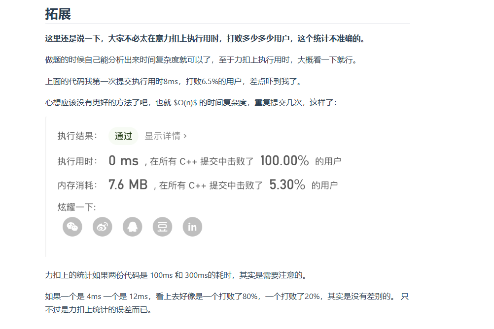

# day4 24,19,142,面试题环形链表
## 24 两两交换链表中的节点
题目：https://leetcode.cn/problems/swap-nodes-in-pairs/description/
```
/**
 * Definition for singly-linked list.
 * struct ListNode {
 *     int val;
 *     ListNode *next;
 *     ListNode() : val(0), next(nullptr) {}
 *     ListNode(int x) : val(x), next(nullptr) {}
 *     ListNode(int x, ListNode *next) : val(x), next(next) {}
 * };
 */
class Solution {
public:
    ListNode* swapPairs(ListNode* head) {
        if(head==nullptr||head->next==nullptr)return head;
        ListNode *_dimmyhead=new ListNode(0);
        _dimmyhead->next=head;
        ListNode *pre =_dimmyhead;
        ListNode *cur=head;
        ListNode *lat=nullptr;//lat=latter
        ListNode *tmp=nullptr;
        while(cur!=nullptr&&cur->next!=nullptr)
        {
            lat=cur->next;
            tmp=cur->next->next;
            pre->next=lat;//交换 
            lat->next=cur;
            cur->next=tmp;
            pre=cur;
            cur=tmp;
        }
        return _dimmyhead->next;
    }
};
```
注意不要被绕晕了
### 笑鼠：


## 19删除链表的倒数第n个节点
题目：https://leetcode.cn/problems/remove-nth-node-from-end-of-list/description/

```
/**
 * Definition for singly-linked list.
 * struct ListNode {
 *     int val;
 *     ListNode *next;
 *     ListNode() : val(0), next(nullptr) {}
 *     ListNode(int x) : val(x), next(nullptr) {}
 *     ListNode(int x, ListNode *next) : val(x), next(next) {}
 * };
 */
class Solution {
public:
    int getlength(ListNode* head)
    {
        int n=0;
        while(head)
        {
            head=head->next;
            n++;
        }
        return n;
    }
    ListNode* removeNthFromEnd(ListNode* head, int n) {
        int sz = getlength(head);
        ListNode *_dimmyhead=new ListNode(0);
        _dimmyhead->next=head;
        ListNode* pre=_dimmyhead;
        ListNode *cur=head;//指示要被删除的节点
        if(n<=sz)
        {
            int tmp=sz-n;
            while(tmp--)
            {
                pre=pre->next;
                cur=cur->next;
            }
            pre->next=cur->next;
            delete cur;
        }
        ListNode *newhead=_dimmyhead->next;
        delete _dimmyhead;
        return newhead;
    }
};
```
代码随想录用的快慢指针，快指针先前进n步，感觉比我这个好点，学习一番
```
class Solution {
public:
    ListNode* removeNthFromEnd(ListNode* head, int n) {
        ListNode* dummyHead = new ListNode(0);
        dummyHead->next = head;
        ListNode* slow = dummyHead;
        ListNode* fast = dummyHead;
        while(n-- && fast != NULL) {
            fast = fast->next;
        }
        fast = fast->next; // fast再提前走一步，因为需要让slow指向删除节点的上一个节点
        while (fast != NULL) {
            fast = fast->next;
            slow = slow->next;
        }
        slow->next = slow->next->next; 
        
        // ListNode *tmp = slow->next;  C++释放内存的逻辑
        // slow->next = tmp->next;
        // delete tmp;
        
        return dummyHead->next;
    }
};
```

## 面试题0207链表相交
题目：
https://leetcode.cn/problems/intersection-of-two-linked-lists-lcci/description/

题目描述就没看懂，揣摩了一下代码随想录，应该是说两个不等长的链表按照尾巴对齐，看看后半部分一不一样，王道题那个果然是很奇怪
结果还是可以直接比较链表啊！为什么会有两个链表后半部分共享同一个指针啊！
```
/**
 * Definition for singly-linked list.
 * struct ListNode {
 *     int val;
 *     ListNode *next;
 *     ListNode(int x) : val(x), next(NULL) {}
 * };
 */
class Solution {
public:
    ListNode *getIntersectionNode(ListNode *headA, ListNode *headB) {
        int lenA,lenB;
        int leftA,leftB;
        leftA=leftB=lenA=lenB=0;
        ListNode* curA=headA;
        ListNode* curB=headB;
        int intersec=INT_MAX;
        while(curA) //计算A的长度
        {
            curA=curA->next;
            lenA++;
        }
        while(curB) //计算B的长度
        {
            curB=curB->next;
            lenB++;
        }
        int l=lenA-lenB;
        curA=headA;curB=headB;
        if(l<0)//说明B比a长,把两个链表向右对齐
        {
            swap(curA,curB);
            swap (lenA, lenB);
            l=-l;
        }
        while(l--)
            {
                curA=curA->next;
                leftA++;
            }
        while(curA!=NULL&&curB!=NULL)//一样长了
        {
            if(curA==curB){return curA;}
            curA=curA->next;leftA++;
            curB=curB->next;leftB++;
        }
        return NULL;
    }
};
```
## 142环形链表2
题目：https://leetcode.cn/problems/linked-list-cycle-ii/description/

我的这个总是在返回节点的时候出现问题，不知道为什么，修正了：不检查fast->next->next以及不把fast=slow放在循环里面，以及把召唤的入口放在循环里面，跑通了
```
/**
 * Definition for singly-linked list.
 * struct ListNode {
 *     int val;
 *     ListNode *next;
 *     ListNode(int x) : val(x), next(NULL) {}
 * };
 */
class Solution {
public:
    ListNode *detectCycle(ListNode *head) {
        if(!head)return head;
        ListNode *fast=head;
        ListNode *slow=head;
        int index=0;
        while(fast!=NULL&&fast->next!=NULL&&fast->next->next!=NULL&&fast!=slow)//如果前一个存在说明没有环，后一个存在说明找到了环，但是这里不一定是环的入口只是在环内
        {
            slow=slow->next;
            fast=fast->next->next;
        }
        if(fast==NULL||fast->next==NULL||fast->next->next==NULL)return NULL;
        if(slow==fast)
        {
            ListNode *meet=head;
            while(slow!=meet)
            {
                slow=slow->next;
                meet=meet->next;
            }
            return slow;
        }
        return NULL;
        }
};
```