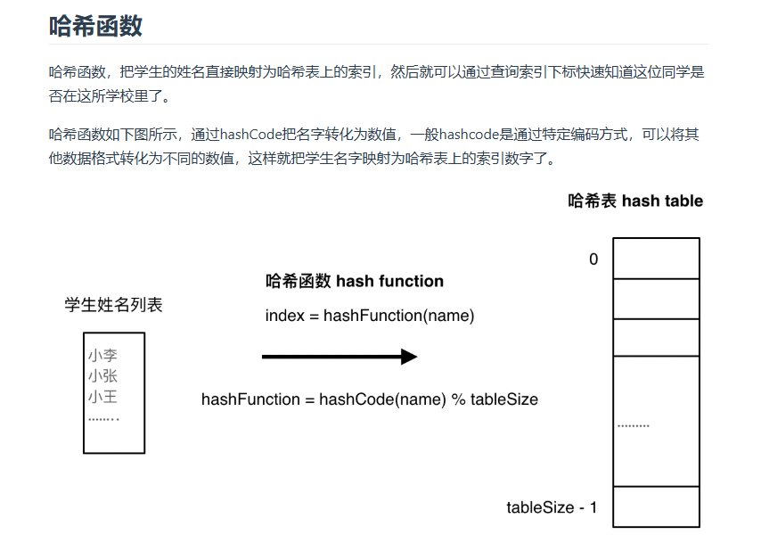

# day6 哈希表基础 202，349，242，1 
## 哈希表基础
**当我们遇到了要快速判断一个元素是否出现集合里的时候，就要考虑哈希法**

**哈希表的本质是空间换时间**


std::unordered_map 底层实现为哈希表，std::map 和std::multimap 的底层实现是红黑树。同理，std::map 和std::multimap 的key也是有序的（这个问题也经常作为面试题，考察对语言容器底层的理解）。

当我们要使用集合来解决哈希问题的时候，优先使用unordered_set，因为它的查询和增删效率是最优的，如果需要集合是有序的，那么就用set，如果要求不仅有序还要有重复数据的话，那么就用multiset。

## 242 有效的字母异位词
题目：https://leetcode.cn/problems/valid-anagram/description/

数组也是哈希表，题目要求是检查两个字符串中出现的字母是不是完全相同，所以用一个字母表大小的数组保存每个字母出现了几次
小巧思：前面一个字符串中每一个字母出现的时候，记录数组里面+1，后一个字符串中每个字母对应-1，最后看记录数组中是不是每一个都是0，一开始我想的是用两个记录数组然后对应位置相减
```
class Solution {
public:
    bool isAnagram(string s, string t) {
        int record[26]={0};
        for(int i=0;i<s.size();i++)
            record[s[i]-'a']++;
        for(int j=0;j<t.size();j++)
            record[t[j]-'a']--;
        for(int k=0;k<26;k++)
            if(record[k]!=0)
                return false;
        return true;
    }
};
```
## 349 两个数组的交集
题目：https://leetcode.cn/problems/intersection-of-two-arrays/description/

单纯用上面那个数组的方法应该算不出来，学习一下unordered_set的用法：https://www.cnblogs.com/JCpeng/p/15227986.html
```
class Solution {
public:
    vector<int> intersection(vector<int>& nums1, vector<int>& nums2) {
        unordered_set<int> res;
        unordered_set<int> nums_set(nums1.begin(),nums1.end());//可以直接这样把数组转成变量
        for(int num:nums2)//遍历nums2
        {
            if(nums_set.find(num)!=nums_set.end())//发现num在numset里面并不是在末尾存在，说明set里面存的有
            {
                res.insert(num);
            }
        }
        return vector<int>(res.begin(),res.end());//还可以这么转成vector
        //时间复杂度是(m+n)，m是最后要把set转成vector，空间复杂度是n
    }
};
```
加入数组的类似方法
```
class Solution {
public:
    vector<int> intersection(vector<int>& nums1, vector<int>& nums2) {
        unordered_set<int> res;
        unordered_set<int> nums_set(nums1.begin(),nums1.end());//可以直接这样把数组转成变量
        int hash[1005]={0};
        for(int num:nums1)//遍历nums2
        {
            hash[num]=1;
        }
        for(int num:nums2)
            {
                if(hash[num]==1)
                    res.insert(num);
            }
            return vector<int>(res.begin(),res.end());
        }
         //还可以这么转成vector
        //时间复杂度是(m+n)，m是最后要把set转成vector，空间复杂度是n
};
```
## 202 快乐数
题目：https://leetcode.cn/problems/happy-number/description/

