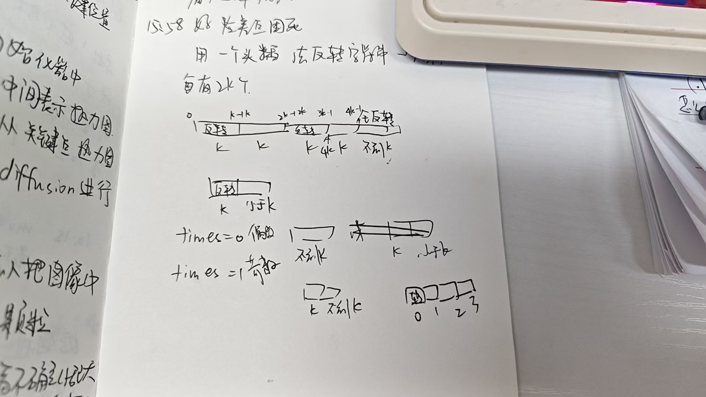

# day8 字符串 344 541,kama54
## 344.反转字符串
题目：https://leetcode.cn/problems/reverse-string/description/


本来以为要用头插法，没想到是更高级的swap。。。。。下次要记得先写再看题解
```
class Solution {
public:
    void reverseString(vector<char>& s) {
        for(int i=0,j=s.size()-1;j>0,i<(s.size()/2);i++,j--)
        swap(s[i],s[j]);

    }
};
```
### 什么时候使用库函数：
如果题目关键的部分直接用库函数就可以解决，建议不要使用库函数。

>毕竟面试官一定不是考察你对库函数的熟悉程度， 如果使用python和java 的同学更需要注意这一点，因为python、java提供的库函数十分丰富。

如果库函数仅仅是 解题过程中的一小部分，并且你已经很清楚这个库函数的内部实现原理的话，可以考虑使用库函数。

建议大家平时在leetcode上练习算法的时候本着这样的原则去练习，这样才有助于我们对算法的理解。

>不要沉迷于使用库函数一行代码解决题目之类的技巧，不是说这些技巧不好，而是说这些技巧可以用来娱乐一下。

>真正自己写的时候，要保证理解可以实现是相应的功能。

如果题目关键的部分直接用库函数就可以解决，建议不要使用库函数。

如果库函数仅仅是 解题过程中的一小部分，并且你已经很清楚这个库函数的内部实现原理的话，可以考虑使用库函数。
## 541.反转字符串Ⅱ
题目：https://leetcode.cn/problems/reverse-string-ii/description/

我想的是：

然后分奇数偶数算，想的挺好但是超时了
```
string reverseStr(string s, int k) {
        int times=s.size()/k;//有多少k
        while(times>-1)
        {
            if(times%2==0)//k是偶数
            {
                if(s.size()-times*(k+1)<0)//说明是尾巴
                {for(int i=times*k,j=s.size()-1;i<s.size(),j>times*k;i++,j--)swap(s[i],s[j]);
                }
                for(int i=times*k,j=times*(k+1)-1;i<times*(k+1),j>times*k;i++,j--)swap(s[i],s[j]);//偶数节k要转
            }
            else//奇数阶除了尾巴不用转
            {
                if(s.size()-times*(k+1)<0)for(int i=times*k,j=s.size()-1;i<s.size(),j>times*k;i++,j--)swap(s[i],s[j]);
            }
        }
        return s;
```
代码随想录的答案
```
class Solution {
public:
    void reverses(string &s,int start,int end)
    {
        for(int i=start,j=end;i<j;i++,j--)swap(s[i],s[j]);
    }
    string reverseStr(string s, int k) {
        for(int i=0;i<s.size();i+=(2*k))//学习一番
        {
            if(i+k<=s.size())//剩余字符小于2k但大于k
            {
                reverses(s,i,i+k-1);
                continue;
            }
            reverses(s,i,s.size()-1);
        }
        return s;
    }
};
```
i每次增加2k,+k是下一个2k的后半部分不用处理，处理i到i+k-1就行了，然后最后一小节直接用size作为后半部分

## 卡玛网 54，替换数字
题目：https://kamacoder.com/problempage.php?pid=1064


我的思路是像链表一样。在那个位置插入字符串，数组不能直接覆盖，所以我就想用一个把它保存下来

看了下题解思路是算出填充之后数组长度，然后从新的长度从后往前填充，旧的也是从后往前检查数字，如果从后往前查到数字就填充，字母就赋值给新的索引
```
#include <iostream>
#include <string>
using namespace std;

int main()
{
    string s;
    int count=0;
    while(cin>>s)
    {
        for(int i=0;i<s.size();i++)
            if(s[i]>='0'&&s[i]<='9')count++;
    }
    int oldIndex=s.size()-1;
    s.resize(s.size()+count*5);
    int newIndex=s.size()-1;
    while(oldIndex>=0)
    {
        if(s[oldIndex]>='0'&&s[oldIndex]<='9')
        {
            s[newIndex--]='r';
            s[newIndex--]='e';
            s[newIndex--]='b';
            s[newIndex--]='m';
            s[newIndex--]='u';
            s[newIndex--]='n';
            
        }
        else s[newIndex--]=s[oldIndex];
        oldIndex--;
    }
    cout<<s<<endl;
    return 0;
}
```