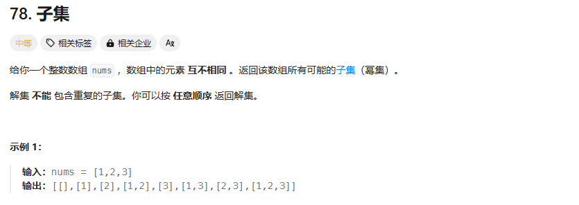

# day24 回溯算法3 93 78 90

## 93 复原ip地址
题目：https://leetcode.cn/problems/restore-ip-addresses/description/


感觉跟上面那个分割回文串好像啊

可恶竟然是 以点为分隔符，非法串的判断方式没有写出来
我想的是当前分段合法就塞进答案，以index遍历到最后了为结束条件，不对
```
class Solution {
public:
    vector<string> res;
    string path;
    int strtoint(string s)
    {
        int sum=0;
        int m=1;
        for(int i=s.size()-1;i>-1;i--)
        {
            if(s[i]<'0'||s[i]>'9')return -1;
            sum+=(s[i]-'0')*m;
            m=m*10;
        }
        return sum;
    }
    void backkk(const string s,int index)
    {
        if(index==s.size())//终止条件
        {
            res.push_back(path);
            return;
        }

        for(int i=index;i<s.size();i++)
        {
            if(i-index+1>3)return;//说明分错了
            string tmp=s.substr(index,i-index+1);
            int num=strtoint(tmp);
            if(-1<num&&num<256)
            {
                path.push_back(tmp);
                path.push_back(".");
               
            }
            else continue;
            backkk(s,index+1);
            path.pop_back();
            path.pop_back();
        }
    }
    vector<string> restoreIpAddresses(string s) {
        res.clear();
        path.clear();
        backkk(s,0);
        return res;
    }
};
```

哦，题解是直接在原来的字符串里面插入点，点数量决定深度，因为点多了一定不对，index是分割线，控制下一层从哪里开始

终止条件：点=3的时候判断第四段是否满足条件，满足条件就插入，否则直接返回

单层递归：判断某段是否符合条件，然后插入点，递归从i+2开始，因为还有一个点，回溯的时候也要把点去掉，不满足条件的break掉

主函数里面检查整个字符串的长度是否符合要求，进行剪枝

小段不满足条件的原因：
1. 以0开始
2. 里面有其他字符
3. 大于255】
```
class Solution {
public:
    vector<string> res;
    bool isvalid(const string &s,int start,int end)
    {
        if(start>end)return false;

        if(s[start]=='0'&&start!=end)return false;

        int num=0;

        for(int i=start;i<=end;i++)//这里end没写等于
        {
            if(s[i]<'0'||s[i]>'9')return false;
            num=num*10+(s[i]-'0');
            //cout<<"start"<<start<<":"<<num<<endl;
            if(num>255)return false;
        }
        return true;
    }
    void backkk(string &s,int index,int pointnum)
    {
        if(pointnum==3)//终止条件
        {
            if(isvalid(s,index,s.size()-1))//左闭右闭区间
                res.push_back(s);
            return;
        }

        for(int i=index;i<s.size();i++)//分割的过程
        {
            bool ll=isvalid(s,index,i);
            //cout<<"i"<<i<<":"<<ll<<endl;
            if(isvalid(s,index,i))
            {
                s.insert(s.begin()+i+1,'.');
                backkk(s,i+2,pointnum+1);
                s.erase(s.begin()+i+1);//把点删掉
            }
            else break;
        }
    }
    vector<string> restoreIpAddresses(string s) {
        res.clear();
        if(s.size()>12||s.size()<4)return res;
        backkk(s,0,0);
        return res;
    }
};
```
好难啊
## 78 子集
题目：https://leetcode.cn/problems/subsets/description/

难道太爱了，以后每道题都有回文字符串的影子
```
class Solution {
public:
    vector<vector<int>> res;
    vector<int>path;
    void backkk(vector<int> nums,int index)
    {
        res.push_back(path);//放在终止条件里会漏掉结果
        if(index==nums.size())//终止条件，其实不写也可以
        // {
        //     res.push_back(path);
            return ;
        // }
        for(int i=index;i<nums.size();i++)
        {
            path.push_back(nums[i]);
            
            backkk(nums,i+1);

            path.pop_back();
        }
    }
    vector<vector<int>> subsets(vector<int>& nums) {
        res.clear();
        path.clear();
        //res.push_back(path);//先把空子集加进去
        backkk(nums,0);
        return res;
    }
};
```

没想明白在哪里res.push还是对递归有点模糊
不是在终止条件收获节点，每一层递归都要返回结果集

相对于分割问题和组合问题，子集问题每一个都是想要的结果，要全部遍历
## 90 子集Ⅱ
题目：https://leetcode.cn/problems/subsets-ii/description/

上个题有重复元素版，又来到去重了吗

```
class Solution {
public:
    vector<vector<int>> res;
    vector<int>path;
    void backkking(vector<int>nums,int index)
    {
        res.push_back(path);
        for(int i=index;i<nums.size();i++)
        {
            if(i>index&&nums[i]==nums[i-1])continue;
            path.push_back(nums[i]);
            backkking(nums,i+1);
            path.pop_back();
        }
    }
    vector<vector<int>> subsetsWithDup(vector<int>& nums) {
        res.clear();
        path.clear();
        sort(nums.begin(),nums.end());
        backkking(nums,0);
        return res;

    }
};
```
AC

天才，无需多言

树层去重树枝不用去重，有重复元素要先排序