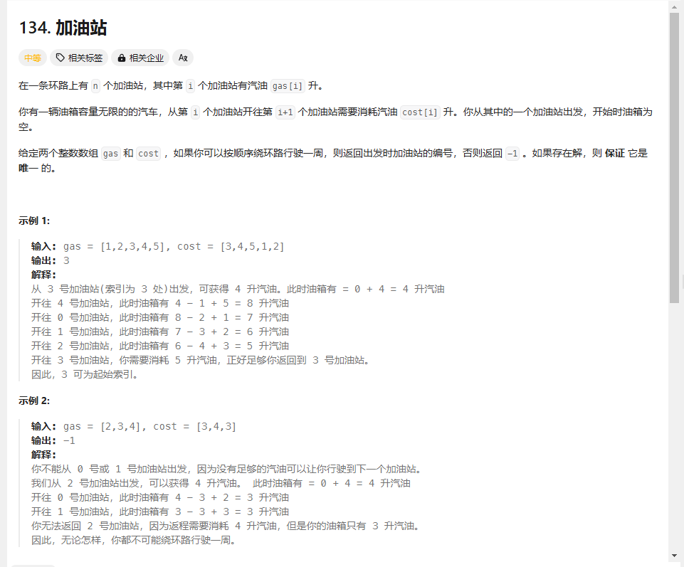

# day29 贪心算法3 134 135 860 406

## 134 加油站
题目：https://leetcode.cn/problems/gas-station/description/

感觉跟昨天那个跳跃游戏有点类似，这个是环形范围能不能覆盖

说是求环形数组最大子序和起点

用一个数组记录到一个加油站油量净值，邮箱里的油不够用的话说明i之前的起始位置是不行的（因为比如说abc，到c点发现小于0，起始点是a，a能经过b到c说明ab，bc值都大于0，现在ac不行，说明bc也不行），就选下一个站点作为新的起始位置

局部最优：当前和小于0就换下一个点作为起点

totalsum是总的加油-消耗，如果算下来这个小于0就肯定跑不到
```
class Solution {
public:
    int canCompleteCircuit(vector<int>& gas, vector<int>& cost) {
        int currentsum=0;//当前局部油量
        int total=0;//整体剩余油量
        int index=0;
        for(int i=0;i<gas.size();i++)
        {
            currentsum += gas[i]-cost[i];
            total += gas[i]-cost[i];
            if(currentsum<0){index=i+1;currentsum=0;}
        }
        if(total<0)return -1;
        return index;
    }
};
```


```
class Solution {
public:
    int canCompleteCircuit(vector<int>& gas, vector<int>& cost) {
        int cover=0;
        int maxcover=0;int index=0;
        int i;
        if(gas.size()==1)return 0;//只有一个站肯定能到达
        int gassum=0;
        while(gassum>-1)
        {
            if(gassum==0){i=index;gassum+=gas[i];}//开始了

            if(i==gas.size()-1)i=-1;

            gassum=gassum-cost[i+1]+gas[i+1];
            i++;
        }
        if(i==index)return index;
        else return -1;
    }
};
```
超时了，不过感觉不对
```

```
## 135 分发糖果
题目：https://leetcode.cn/problems/candy/description/

先都发一个，然后每一个人跟前面的比，三个人站在一起的结果只会有111（111），112（112），123（122），122（121），121（121），211（211），212（212），221（121）
错误：
```
class Solution {
public:
    int candy(vector<int>& ratings) {
        int sum=ratings.size();
        for(int i=1;i<ratings.size();i++)
        {
            if(ratings[i]!=ratings[i-1])sum++;
            if(i<ratings.size()-1&&((ratings[i-1]<ratings[i]&&ratings[i]>ratings[i+1])))sum--;
        }
        return sum;
    }
};
```

本来想的是不等于就多一个吗，不管是前面的获得还是后面的获得都是+1，但是121这种情况多加了，后面这个样例没懂[1,2,87,87,87,2,1]

欸其实是可以设置一个flag的吧

看题解ing

先确定一边，再确定另一边，先确定后面比前面大，后面+1，再确定后面比前面小，这种要从后向前遍历，然后取两趟遍历中比较大的结果

+1是基于上一个被分到的饼干+1.不是1+1
```
class Solution {
public:
    int candy(vector<int>& ratings) {
        vector<int>candys(ratings.size(),1);
        for(int i=1;i<ratings.size();i++)
        {
            if(ratings[i]>ratings[i-1])candys[i]=candys[i-1]+1;
        }
        for(int i=ratings.size()-2;i>=0;i--)
        {
            if(ratings[i]>ratings[i+1])candys[i]=max(candys[i+1]+1,candys[i]);
        }
        int sum=0;
        for(int i=0;i<candys.size();i++)sum += candys[i];

        return sum;
    }
};
```
## 860 柠檬水找零
题目：https://leetcode.cn/problems/lemonade-change/description/

跟我想的不太一样，跟面值有关系

题解

```
class Solution {
public:
    bool lemonadeChange(vector<int>& bills) {
        vector<int>money(3,0);//分别代表5，10，15的钱
        for(int i=0;i<bills.size();i++)
        {

            if(bills[i]==5)
            {
                money[0]++;
            }
            if(bills[i]==10)
            {
                money[1]++;
                money[0]--;
                if(money[0]<0)return false;
            }
            if(bills[i]==20){//20k块
                money[2]++;
                if(money[1]>0&&money[0]>0)//有10块先用10块
                    {
                        money[1]--;//money[0]--
                    }
                else {money[0]--;money[0]--;}

                money[0]--;
                if(money[0]<0)return false;
                if(money[1]<0)return false;
                //cout<<"i"<<i<<" "<<"5 10 15"<<money[0]<<" "<<money[1]<<"money[2]<<endl;
            }
            //cout<<"i"<<i<<" "<<"5 10 15"<<money[0]<<" "<<money[1]<<" "<<money[2]<<endl;
            
        }
        return true;
    }
}; 
```
## 406 根据身高重建队列
题目：https://leetcode.cn/problems/queue-reconstruction-by-height/description/

没看懂题

要把序列拍成符合描述的，比如说身高是7，前面有0个就是[7,0],先排身高，再排次序，k应该是从小到大排，因为表示的是前面有多少个比当前大，身高从大到小排

```
class Solution {
public:
    static bool cmp(const vector<int>& a,const vector<int>& b)
    {
        if(a[0]==b[0])return a[1]<b[1];
        return (a[0]>b[0]);
    }
    vector<vector<int>> reconstructQueue(vector<vector<int>>& people) {
        sort(people.begin(),people.end(),cmp);
        vector<vector<int>>que;
        for(int i=0;i<people.size();i++)
        {
            int position=people[i][1];
            que.insert(que.begin() + position, people[i]);
        }
        return que;
    }
};
```

但使用vector是非常费时的，C++中vector（可以理解是一个动态数组，底层是普通数组实现的）如果插入元素大于预先普通数组大小，vector底部会有一个扩容的操作，即申请两倍于原先普通数组的大小，然后把数据拷贝到另一个更大的数组上。

所以使用vector（动态数组）来insert，是费时的，插入再拷贝的话，单纯一个插入的操作就是O(n^2)了，甚至可能拷贝好几次，就不止O(n^2)了


可以用链表方式实现