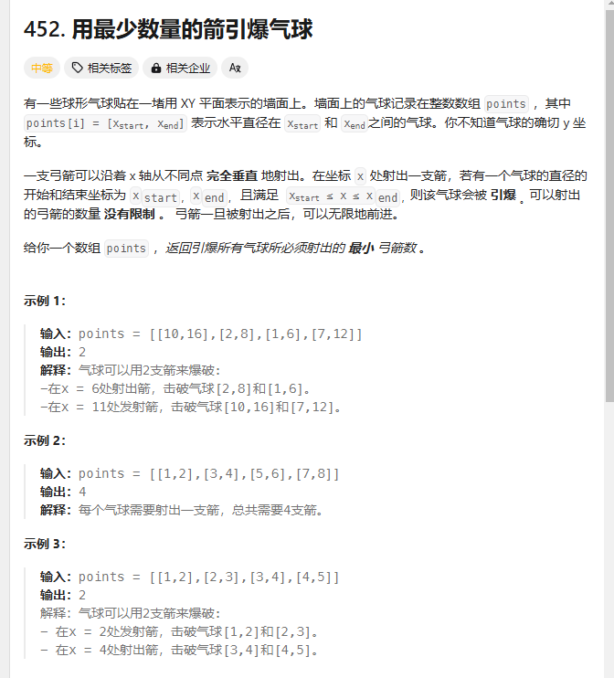

# day30 贪心算法4 重叠区间 452 435 763

## 452 用最少数量的箭引爆气球
题目：https://leetcode.cn/problems/minimum-number-of-arrows-to-burst-balloons/description/


如果子集A在子集B里，那打了A也就是打了B

局部最优尽量用一只弓箭射尽量多气球

统一按照左边界排序，让重叠气球尽可能相邻

左边界大于上一个气球右边界，一定不相邻

更新右边界：两个气球右边界的最小值
```
class Solution {
public:
    static bool cmp(const vector<int>&a,const vector<int>&b)
    {
        return a[0]<b[0];
    } 
    int findMinArrowShots(vector<vector<int>>& points) {
        int num=1;
        if(points.size()==0)return 0;
        sort(points.begin(),points.end(),cmp);
        for(int i=1;i<points.size();i++)
        {
            if(points[i][0]>points[i-1][1])num++;
            else
            {
                points[i][1]=min(points[i][1],points[i-1][1]);
            }
        }
    return num;
    }
};
```
## 435 无重叠区间
题目：https://leetcode.cn/problems/non-overlapping-intervals/description/

有重叠的删掉大的那个（错误）

```
class Solution {
public:
    static bool cmp(const vector<int>&a,const vector<int>&b)
    {
        return a[0]<b[0];
    } 
    int eraseOverlapIntervals(vector<vector<int>>& intervals) {
        int num=0;
        sort(intervals.begin(),intervals.end(),cmp);
        for(int i=1;i<intervals.size();i++)
        {
            if(intervals[i][0]<intervals[i-1][1]){//有重叠
                num++;
                int size1=intervals[i][1]-intervals[i][0];
                int size2=intervals[i-1][1]-intervals[i-1][0];
                if(size1>=size2)intervals[i][1]=intervals[i][0];
                else intervals[i-1][1]=intervals[i-1][0];
            }
        }
    return num;
        }
```

总是有样例过不了

题解：求重叠了夺少区间就是需要删除的区间，重叠的时候把当前右边界放在比较小的地方
```
class Solution {
public:
    static bool cmp(const vector<int>&a,const vector<int>&b)
    {
        return a[0]<b[0];
    } 
    int eraseOverlapIntervals(vector<vector<int>>& intervals) {
        int num=0;
        sort(intervals.begin(),intervals.end(),cmp);
        for(int i=1;i<intervals.size();i++)
        {
            if(intervals[i][0]<intervals[i-1][1]){//有重叠
                num++;
                intervals[i][1]=min(intervals[i][1],intervals[i-1][1]);
            }
        }
    return num;
        }
    
};
```

本质都是求重叠区间
## 763 划分字母区间
题目：https://leetcode.cn/problems/partition-labels/description/

感觉可以设置一个辅助数组保存某个字母最开始和最后出现的位置，然后如果有重叠的话就设置一个最大的边界

一个下标对应值是最远位置，区间里有大于这个最远位置的就更新最远位置

```
class Solution {
public:
    vector<int> partitionLabels(string s) {
        int hash[27]={0};
        int left=0;int right=0;int length=0;
        vector<int> res;
        for(int i=0;i<s.size();i++)
        {
           hash[s[i]-'a']=i;
        }
        for(int i=0;i<s.size();i++)
        {
            right=max(right,hash[s[i] - 'a']);
            if(i==right)//i=最远边界的时候可以收集下一个区间了
            {
                res.push_back(right-left+1);
                left=i+1;
            }
        }
        return res;
    }
};
```
这个题的代码比较巧妙，可以注意