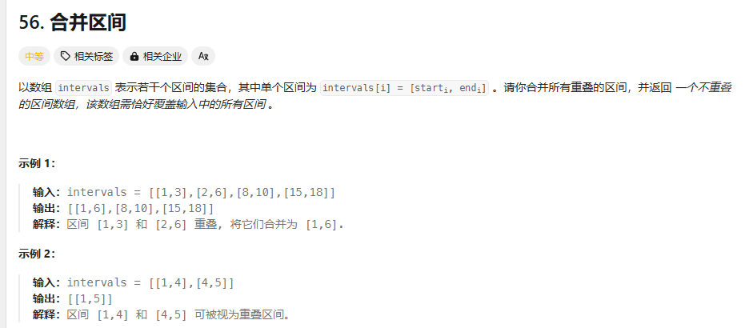

# day31 贪心算法5 56 738 968 总结

## 56 合并区间
题目：https://leetcode.cn/problems/merge-intervals/description/



检测到合并就取最左边的左边界和最右边的右边界，直到不重叠，把新数组插入结果集

```
class Solution {
public:
    static bool cmp(const vector<int>&a,const vector<int>&b)
    {
        return a[0]<b[0];
    }
    vector<vector<int>> merge(vector<vector<int>>& intervals) {
        vector<int> path(2,0);
        vector<vector<int>> res;
        sort(intervals.begin(),intervals.end(),cmp);
        int start;int end;
        if(intervals.size()==1)res.push_back(intervals[0]);
        for(int i=1;i<intervals.size();i++)
        {
            
            if(intervals[i][0]<=intervals[i-1][1])//重叠
            {
                start=min(intervals[i][0],intervals[i-1][0]);
                end=max(intervals[i][1],intervals[i-1][1]);
                intervals[i][1]=max(intervals[i][1],intervals[i-1][1]);
                
                //i++;
                //cout<<"staart"<<start<<"end"<<end<<endl;
            }
            
            else
            {
                if(i==1)
                {
                    start=intervals[0][0];end=intervals[0][1];
                    path[0]=start;path[1]=end;
                    res.push_back(path);
                }
                start=intervals[i][0];end=intervals[i][1];
            }

                path[0]=start;path[1]=end;
                res.push_back(path);
            

           
        }    
         return res;
    }
};
```
这个方法输入结果集之后就无法再修改，现在我要尝试再原数组上修改了
```
class Solution {
public:
    static bool cmp(const vector<int>&a,const vector<int>&b)
    {
        return a[0]<b[0];
    }
    vector<vector<int>> merge(vector<vector<int>>& intervals) {
        vector<int> path(2,0);
        vector<vector<int>> res;
        sort(intervals.begin(),intervals.end(),cmp);
        int start;int end;
        path=intervals[0];
        for(int i=1;i<intervals.size();i++)
        {
            
            if(intervals[i][0]<=path[1])//重叠
            {
                path[0]=min(path[0],intervals[i][0]);
                path[1]=max(intervals[i][1],path[1]);
                }
            
            else
            {
               res.push_back(path);
               path[0]=intervals[i][0];path[1]=intervals[i][1];
            }
        }    
        res.push_back(path);
         return res;
    }
};
```
改成修改path数组之后就成功了，最后需要再加一次结果集因为最后一次只更新path了，上面这里可以只更新右边界，因为左边界一定是最小的

题解是对res的最后一个元素进行处理，这样就不用额外使用一个path了

## 738 单调递增数字
题目：https://leetcode.cn/problems/monotone-increasing-digits/description/

没啥思路

每个位数上都单调递增

题解的思路:

原本的数字前面比后面大的时候最高位要减一位，剩下的选最大的，如32要3-1后一位选9，要从后往前遍历

```
class Solution {
public:
    int monotoneIncreasingDigits(int n) {
        string str=to_string(n);
        int flag=str.size();//标记从哪一位往后标记成999
        for(int i=str.size()-1;i>0;i--)
        {
            if(str[i-1]>str[i]){str[i-1]--; flag=i;}

        }
        for(int i=flag;i<str.size();i++)
        {
            str[i]='9';
        }
        return stoi(str);
    }
};
```
## 968 监控二叉树
题目：https://leetcode.cn/problems/binary-tree-cameras/description/

想了一下没想到，一开始的想法是如果i有孩子和孩子的孩子，就在孩子上装一个摄像头，否则就在自己身上装一个

在叶子节点上一层放摄像头，然后每隔两个放一个摄像头

遍历顺序：后序，回溯，用一个变量表示状态（0无覆盖，1有摄像头，2有覆盖无摄像头被有无覆盖的状态包括了）
空节点要设置成有覆盖的状态(状态2)，不然会影响别的摄像头的设置

1. 左右孩子都有覆盖：左右孩子都是状态2，母节点是状态0，等着被上层覆盖
2. 左右孩子至少有一个无覆盖，母节点要装摄像头
3. 左右孩子至少有一个有摄像头，母节点一定是有覆盖
4. 遍历完了根节点还无覆盖：根节点加一个摄像头

```
class Solution {
public:
    int res=0;
    int travell(TreeNode* cur)
    {
        if(cur==nullptr)return 2;
        int left = travell(cur->left);
        int right=travell(cur->right);
        if(left==2&&right==2)return 0;
        
        if(left==0||right==0){res++; return 1;}

        return 2;
    } 
    int minCameraCover(TreeNode* root) {
        res=0;
        int rr=travell(root);
        if(rr==0)res++;//最后根节点没有覆盖还要加一个
        return res;
    }
};
```
## 总结