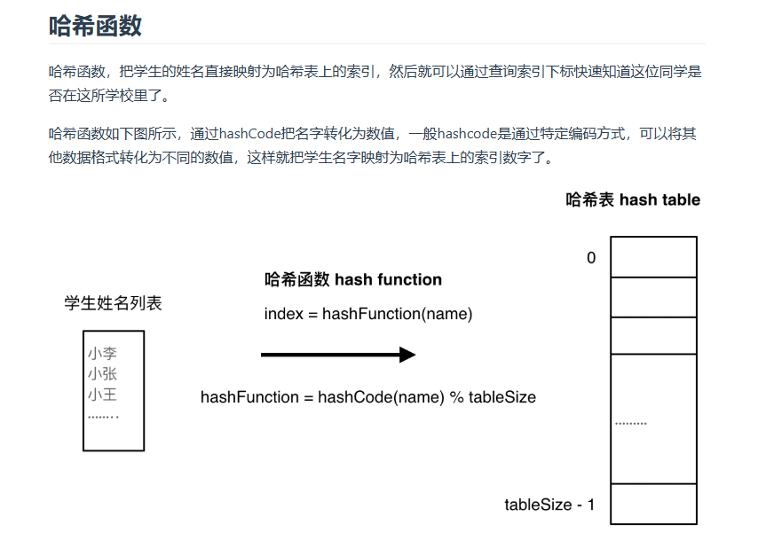

# day6 哈希表基础 202，349，242，1 
## 哈希表基础
**当我们遇到了要快速判断一个元素是否出现集合里的时候，就要考虑哈希法，哈希值比较小，范围比较小，可控时可以用数组，数值很大用set，key对应value用map**

**哈希表的本质是空间换时间**


**去重：set，没有数值限制用set。数值很大用数组就不合适，数值不大但是分布很分散也比较合适用set不适合用数组**

std::unordered_map 底层实现为哈希表，std::map 和std::multimap 的底层实现是红黑树。同理，std::map 和std::multimap 的key也是有序的（这个问题也经常作为面试题，考察对语言容器底层的理解）。

当我们要使用集合来解决哈希问题的时候，优先使用unordered_set，因为它的查询和增删效率是最优的，

**如果需要集合是有序的，那么就用set，如果要求不仅有序还要有重复数据的话，那么就用multiset。**

C++ 中 set 和 unordered_set 常用语法
https://blog.csdn.net/weixin_45823587/article/details/124550001


## 242 有效的字母异位词
题目：https://leetcode.cn/problems/valid-anagram/description/

数组也是哈希表，题目要求是检查两个字符串中出现的字母是不是完全相同，所以用一个字母表大小的数组保存每个字母出现了几次
小巧思：前面一个字符串中每一个字母出现的时候，记录数组里面+1，后一个字符串中每个字母对应-1，最后看记录数组中是不是每一个都是0，一开始我想的是用两个记录数组然后对应位置相减
```
class Solution {
public:
    bool isAnagram(string s, string t) {
        int record[26]={0};
        for(int i=0;i<s.size();i++)
            record[s[i]-'a']++;
        for(int j=0;j<t.size();j++)
            record[t[j]-'a']--;
        for(int k=0;k<26;k++)
            if(record[k]!=0)
                return false;
        return true;
    }
};
```
## 349 两个数组的交集
题目：https://leetcode.cn/problems/intersection-of-two-arrays/description/

单纯用上面那个数组的方法应该算不出来，学习一下unordered_set的用法：https://www.cnblogs.com/JCpeng/p/15227986.html

set本身可以去重

```
class Solution {
public:
    vector<int> intersection(vector<int>& nums1, vector<int>& nums2) {
        unordered_set<int> res;
        unordered_set<int> nums_set(nums1.begin(),nums1.end());//可以直接这样把数组转成变量
        for(int num:nums2)//遍历nums2
        {
            if(nums_set.find(num)!=nums_set.end())//发现num在numset里面并不是在末尾存在，说明set里面存的有
            {
                res.insert(num);
            }
        }
        return vector<int>(res.begin(),res.end());//还可以这么转成vector
        //时间复杂度是(m+n)，m是最后要把set转成vector，空间复杂度是n
    }
};
```
加入数组的类似方法
```
class Solution {
public:
    vector<int> intersection(vector<int>& nums1, vector<int>& nums2) {
        unordered_set<int> res;
        unordered_set<int> nums_set(nums1.begin(),nums1.end());//可以直接这样把数组转成变量
        int hash[1005]={0};
        for(int num:nums1)//遍历nums2
        {
            hash[num]=1;
        }
        for(int num:nums2)
            {
                if(hash[num]==1)
                    res.insert(num);
            }
            return vector<int>(res.begin(),res.end());
        }
         //还可以这么转成vector
        //时间复杂度是(m+n)，m是最后要把set转成vector，空间复杂度是n
};
```
## 202 快乐数
题目：https://leetcode.cn/problems/happy-number/description/

>还有一个难点就是求和的过程，如果对取数值各个位上的单数操作不熟悉的话，做这道题也会比较艰难
>
是的我还没掌握怎么取数。。但是怎么好像就是普通生成啊

我一开始的思路应该是：用一个循环一直算各个位数的平方和，直到它为1，就是字面上的意思

但是既然它是一个哈希表问题所以揣摩一下怎么用哈希做

看代码随想录的思路是把每次算出来的和放在哈希表里（因为它是一个判断一个数是不是出现多次的问题），然后如果再次出现，说明已经陷入无限循环了
```
class Solution {
public:
    int caculsum(int n)
    {
        int sum=0;int k=0;
        while(n)
        {
            k=n%10;
            n=n/10;
            sum+=k*k;
        }
        return sum;
    }

    bool isHappy(int n) {
        unordered_set<int> set;
        int sum=0;
        while(1)
        {
            sum=caculsum(n);
            if(sum==1)return true;
            if(set.find(sum)!=set.end())
                return false;
            else
                set.insert(sum);
            n=sum;
        }
    }
};
```
## 1两数之和
题目：https://leetcode.cn/problems/two-sum/description/

vector常用操作
https://blog.csdn.net/Flag_ing/article/details/123380655

是不是可以把数放在哈希表里，然后检查target-某个元素是不是在哈希表里，因为结果唯一所以只会找到一个结果，找不到就没有

sos问了poe好像没有只用unordered_set<int>的方法，要用map

学学


>再来看一下使用数组和set来做哈希法的局限。
>
>数组的大小是受限制的，而且如果元素很少，而哈希值太大会造成内存空间的浪费。

>set是一个集合，里面放的元素只能是一个key，而两数之和这道题目，不仅要判断y是否存在而且还要记录y的下标位置，因为要返回x 和 y的下标。所以set 也不能用。

>此时就要选择另一种数据结构：map ，map是一种key value的存储结构，可以用key保存数值，用value再保存数值所在的下标。

好好好...

>本题其实有四个重点：
>1. 为什么会想到用哈希表
>2. 哈希表为什么用map
>3. 本题map是用来存什么的
>4. map中的key和value用来存什么的
>把这四点想清楚了，本题才算是理解透彻了。

>很多录友把这道题目 通过了，但都没想清楚map是用来做什么的，以至于对代码的理解其实是 一知半解的。


map简单使用方法：
1. https://blog.csdn.net/zou_albert/article/details/106983268
2. https://blog.csdn.net/jingyi130705008/article/details/82633778
3. https://www.runoob.com/cplusplus/cpp-libs-unordered_map.html

要查找元素是否出现过，所以把元素作为key，下标作为value，map存放遍历过的元素

map和multimap是红黑树，unorderedmap是哈希结构
```
#include <iostream>
#include <vector>

class Solution {
public:
    vector<int> twoSum(vector<int>& nums, int target) {
        std::unordered_map<int,int>rec;
        int k=0;
        for(int i=0;i<nums.size();i++)
        {
            k=target-nums[i];
            auto iter = rec.find(k);
            if(iter!=rec.end())return {iter->second,i};//如果找到了
            rec.insert(pair<int,int>(nums[i],i));
        }
        return {};
    }
};
```